# asky Architecture

This document provides a high-level overview of the **asky** codebase architecture. For detailed package documentation, see the `AGENTS.md` files in each subdirectory.

## Overview

asky is an AI-powered CLI tool that combines LLM capabilities with web search and tool-calling to provide intelligent, research-backed answers to queries. It also includes an optional XMPP foreground daemon mode for remote command/query handling.

```mermaid
graph TB
    subgraph API["Library API Layer (api/)"]
        api_types["types.py<br/>AskyConfig/TurnRequest/TurnResult"]
        api_client["client.py<br/>AskyClient Orchestration"]
        api_ctx["context.py<br/>History Context Resolution"]
        api_session["session.py<br/>Session Lifecycle Resolution"]
        api_preload["preload.py<br/>Local + Shortlist Preload Pipeline"]
        api_ex["exceptions.py<br/>Public Errors"]
    end

    subgraph CLI["CLI Layer (cli/)"]
        main["main.py<br/>Entry Point"]
        chat["chat.py<br/>Chat Flow"]
        presets_cli["presets.py<br/>Backslash Preset Expansion"]
        local_ingest["local_ingestion_flow.py<br/>Pre-LLM Local Corpus Ingestion"]
        research_cmd["research_commands.py<br/>Manual No-LLM Corpus Query"]
        section_cmd["section_commands.py<br/>Manual No-LLM Section Summary"]
        shortlist_flow["shortlist_flow.py<br/>Pre-LLM Shortlist Orchestration"]
        history["history.py<br/>History Commands"]
        sessions_cli["sessions.py<br/>Session Commands"]
        prompts_cli["prompts.py<br/>Prompt Commands"]
        utils["utils.py<br/>Utilities"]
    end

    subgraph Core["Core Layer (core/)"]
        engine["engine.py<br/>ConversationEngine"]
        tool_factory["tool_registry_factory.py<br/>Registry Construction"]
        registry["registry.py<br/>ToolRegistry"]
        llm_client["api_client.py<br/>LLM API Client"]
        session_mgr["session_manager.py<br/>SessionManager"]
        prompts_core["prompts.py<br/>Prompt Construction"]
    end

    subgraph Daemon["Daemon Layer (daemon/)"]
        daemon_service["service.py<br/>DaemonService (transport-agnostic)"]
        daemon_menubar["menubar.py<br/>Singleton Lock + Launcher"]
        daemon_tray_proto["tray_protocol.py<br/>TrayApp ABC + TrayStatus"]
        daemon_tray_ctrl["tray_controller.py<br/>TrayController (shared logic)"]
        daemon_tray_macos["tray_macos.py<br/>MacosTrayApp (rumps)"]
        daemon_app_bundle["app_bundle_macos.py<br/>macOS .app Bundle Creation"]
    end

    subgraph XMPPPlugin["XMPP Daemon Plugin (plugins/xmpp_daemon/)"]
        xmpp_plugin["plugin.py<br/>XMPPDaemonPlugin"]
        xmpp_service["xmpp_service.py<br/>XMPPService + per-JID queues"]
        daemon_xmpp["xmpp_client.py<br/>Slixmpp Transport Wrapper"]
        daemon_router["router.py<br/>Ingress Routing + Policy"]
        daemon_exec["command_executor.py<br/>Command/Query Bridge"]
        daemon_profiles["session_profile_manager.py<br/>Room/Session Bindings + Session Overrides"]
        daemon_planner["interface_planner.py<br/>Interface Model Planner"]
        daemon_voice["voice_transcriber.py<br/>Async Voice Jobs"]
        daemon_image["image_transcriber.py<br/>Async Image Jobs"]
        daemon_doc_ingest["document_ingestion.py<br/>Upload URL -> Local Corpus Ingestion"]
        daemon_transcripts["transcript_manager.py<br/>Transcript Lifecycle"]
        daemon_chunking["chunking.py<br/>Outbound Chunking"]
    end

    subgraph Storage["Storage Layer (storage/)"]
        interface["interface.py<br/>HistoryRepository ABC"]
        sqlite["sqlite.py<br/>SQLiteHistoryRepository"]
    end

    subgraph Config["Configuration Layer (config/)"]
        config_init["__init__.py<br/>Constants Export"]
        loader["loader.py<br/>TOML Loader"]
    end

    subgraph Research["Research Mode (research/)"]
        cache["cache.py<br/>ResearchCache"]
        vector["vector_store.py<br/>VectorStore"]
        vector_ops["vector_store_*_ops.py<br/>Chunk/Link/Finding Ops"]
        vector_common["vector_store_common.py<br/>Shared Math/Constants"]
        sections["sections.py<br/>Section Index + Strict Match"]
        shortlist["source_shortlist.py<br/>Pre-LLM Ranking"]
        shortlist_ops["shortlist_collect.py<br/>shortlist_score.py"]
    end

    subgraph Plugins["Plugin Runtime (plugins/)"]
        plugin_runtime["runtime.py<br/>Process Runtime Bootstrap"]
        plugin_manager["manager.py<br/>Manifest + Lifecycle"]
        plugin_hooks["hooks.py<br/>Deterministic Hook Registry"]
        persona_creator["manual_persona_creator/*<br/>Persona Build/Export Tools"]
        persona_manager["persona_manager/*<br/>Import/Bind/Inject Persona Context"]
        gui_plugin["gui_server/*<br/>NiceGUI Daemon Sidecar"]
        xmpp_daemon_plugin["xmpp_daemon/*<br/>XMPP Transport Plugin"]
        playwright_plugin["playwright_browser/*<br/>Browser Retrieval Plugin"]
    end

    subgraph Tools["Tool Execution"]
        tools["tools.py<br/>Web Search, URL Fetch"]
    end

    api_client --> api_ctx
    api_client --> api_session
    api_client --> api_preload
    api_client --> engine
    api_client --> session_mgr
    api_ctx --> sqlite
    api_session --> sqlite
    api_preload -.-> local_ingest
    api_preload -.-> shortlist
    main --> chat
    main --> daemon_service
    main --> daemon_menubar
    main --> research_cmd
    main --> section_cmd
    main --> presets_cli
    main --> plugin_runtime
    chat --> api_client
    main --> history
    main --> sessions_cli
    main --> prompts_cli
    chat --> engine
    chat --> tool_factory
    tool_factory --> registry
    engine --> registry
    engine --> llm_client
    chat --> session_mgr
    session_mgr --> sqlite
    history --> sqlite
    sessions_cli --> sqlite
    daemon_service --> plugin_hooks
    daemon_menubar --> daemon_tray_macos
    daemon_tray_macos --> daemon_tray_ctrl
    daemon_tray_macos --> daemon_tray_proto
    daemon_tray_ctrl --> daemon_tray_proto
    xmpp_plugin --> xmpp_service
    xmpp_service --> daemon_xmpp
    xmpp_service --> daemon_router
    xmpp_service --> daemon_chunking
    xmpp_service --> daemon_doc_ingest
    daemon_router --> daemon_planner
    daemon_router --> daemon_exec
    daemon_router --> daemon_profiles
    daemon_router --> daemon_voice
    daemon_router --> daemon_image
    daemon_router --> daemon_transcripts
    daemon_doc_ingest --> sqlite
    daemon_exec --> api_client
    daemon_exec --> daemon_profiles
    daemon_transcripts --> sqlite
    xmpp_daemon_plugin --> xmpp_plugin
    registry --> tools
    plugin_runtime --> plugin_manager
    plugin_manager --> plugin_hooks
    plugin_manager --> persona_creator
    plugin_manager --> persona_manager
    plugin_manager --> gui_plugin
    api_client --> plugin_hooks
    tool_factory --> plugin_hooks
    engine --> plugin_hooks
    registry --> plugin_hooks
    daemon_service --> plugin_hooks
    config_init --> loader
    shortlist_flow -.-> shortlist
    shortlist -.-> shortlist_ops
    vector -.-> vector_ops
    section_cmd -.-> sections
    vector_ops -.-> vector_common
    chat -.-> cache
```

Current CLI routing supports a grouped command surface (`history/session/memory/corpus`) and a single config mutation entrypoint (`--config <domain> <action>`). `main.py` normalizes that surface into internal flags before dispatch.



---

## Package Structure

```
src/asky/
├── api/                # Programmatic library API surface (run_turn orchestration)
├── cli/                # Command-line interface → see cli/AGENTS.md
├── daemon/             # Daemon lifecycle core: DaemonService, menubar launcher, tray abstraction
├── core/               # Conversation engine → see core/AGENTS.md
├── storage/            # Data persistence → see storage/AGENTS.md
├── research/           # Research mode RAG → see research/AGENTS.md
├── memory/             # Cross-session user memory → see memory/AGENTS.md
├── plugins/            # Optional plugin runtime + built-in plugins (persona/gui/xmpp_daemon)
├── evals/              # Manual integration eval harnesses (research + standard)
├── config/             # Configuration → see config/AGENTS.md
├── tools.py            # Tool execution (web search, URL fetch, custom)
├── retrieval.py        # Shared URL fetch + Trafilatura extraction
├── url_utils.py        # Shared URL sanitization/normalization helpers
├── lazy_imports.py     # Shared lazy import/call helper utilities
├── summarization.py    # Query/answer summarization
├── push_data.py        # HTTP data push to endpoints
├── html.py             # HTML stripping and link extraction
├── email_sender.py     # Email sending via SMTP
├── rendering.py        # Browser rendering of markdown
├── banner.py           # CLI banner display
└── logger.py           # Logging configuration
```

For test organization, see `tests/AGENTS.md`.

---

## Package Documentation

| Package     | Documentation                                     | Key Components                                                              |
| ----------- | ------------------------------------------------- | --------------------------------------------------------------------------- |
| `cli/`      | [cli/AGENTS.md](src/asky/cli/AGENTS.md)           | Entry point, chat flow, commands                                            |
| `daemon/`   | [daemon/AGENTS.md](src/asky/daemon/AGENTS.md)     | Transport-agnostic `DaemonService`, menubar launcher, `TrayApp` abstraction |
| `api/`      | [api/AGENTS.md](src/asky/api/AGENTS.md)           | `AskyClient`, turn orchestration services                                   |
| `core/`     | [core/AGENTS.md](src/asky/core/AGENTS.md)         | ConversationEngine, ToolRegistry, API client                                |
| `storage/`  | [storage/AGENTS.md](src/asky/storage/AGENTS.md)   | SQLite repository, data model                                               |
| `research/` | [research/AGENTS.md](src/asky/research/AGENTS.md) | Cache, vector store, embeddings                                             |
| `memory/`   | [memory/AGENTS.md](src/asky/memory/AGENTS.md)     | Cross-session user memory store, recall, tools                              |
| `plugins/`  | [plugins/AGENTS.md](src/asky/plugins/AGENTS.md)   | Plugin manager/runtime, hook registry, persona plugins, GUI server plugin   |
| `evals/`    | (manual harness)                                  | Dual-mode research integration evaluation runner                            |
| `config/`   | [config/AGENTS.md](src/asky/config/AGENTS.md)     | TOML loading, constants                                                     |
| `tests/`    | [tests/AGENTS.md](tests/AGENTS.md)                | Test organization, patterns                                                 |

---

## Data Flow

### Standard Query Flow

```
User Query
    ↓
CLI (main.py) → parse args (`-r` corpus pointers + `--shortlist` override)
    ↓
optional plugin runtime init (`plugins/runtime.py`) from `~/.config/asky/plugins.toml`
    ↓
chat.py → build AskyTurnRequest + UI callbacks
    ↓
AskyClient.run_turn()
    ↓
context.py → resolve history selectors + context payload
    ↓
session.py → resolve create/resume/auto/research session state
    ↓
emit `SESSION_RESOLVED` plugin hook
    ↓
preload.py → optional local_ingestion + shortlist pipeline
           → research-mode deterministic bootstrap retrieval over preloaded corpus handles
           → standard-mode seed URL content preload (budget-aware)
    ↓
retrieval.py (fetch_url_document) → emit `FETCH_URL_OVERRIDE` plugin hook
    ↓
emit `PRE_PRELOAD` / `POST_PRELOAD` plugin hooks
    ↓
build_messages() (inside AskyClient)
    ↓
apply `SYSTEM_PROMPT_EXTEND` chain hook
    ↓
create ToolRegistry (mode-aware + runtime tool exclusions)
    ↓
emit `TOOL_REGISTRY_BUILD` plugin hook
    ↓
apply optional config-driven prompt text overrides for built-in tools
    ↓
append enabled tool guidelines to system prompt
    ↓
ConversationEngine.run()
    ↓
┌─────────────────────────────────────┐
│ Multi-Turn Loop:                    │
│   1. Send messages to LLM           │
│   2. `PRE_LLM_CALL` / `POST_LLM_RESPONSE` hooks
│   3. Parse tool calls (if any)      │
│   4. Dispatch via ToolRegistry (`PRE_TOOL_EXECUTE` / `POST_TOOL_EXECUTE`) │
│   5. Append results to messages     │
│   6. Repeat until no more calls     │
└─────────────────────────────────────┘
    ↓
emit `TURN_COMPLETED` plugin hook
    ↓
generate_summaries() → persist (session/history)
    ↓
(Optional) render_to_browser() / send_email()
```

`main.py` also exposes deterministic no-main-model corpus utilities:

- `--query-corpus` → `cli/research_commands.py`
- `--summarize-section` (+ `--section-source`, `--section-id`, `--section-include-toc`, `--section-detail`, `--section-max-chunks`) → `cli/section_commands.py`

Local section workflows now use canonical section references:

- `list_sections` defaults to canonical body sections (TOC/micro duplicates hidden),
- each row includes `section_ref` (`corpus://cache/<id>#section=<section-id>`),
- retrieval tools also accept compatibility legacy section-suffixed sources
  (`corpus://cache/<id>/<section-id>`) while explicit `section_ref`/`section_id`
  is the preferred contract.

Verbose tracing has two levels:

- `-v`: existing verbose diagnostics (tool-call traces, shortlist traces, debug-friendly status output).
- `-vv`: includes `-v` behavior and additionally prints fully expanded main-model
  I/O payloads in boxed console output:
  - outbound request messages sent to the main model (all roles, full bodies),
  - inbound response messages returned by the main model (including tool-call payloads).
    In Live-banner mode these traces stream immediately through the live console
    (no end-of-turn deferral). Tool/summarization internals are shown as transport
    metadata (target endpoint, response status/type, and response size), not full bodies.
    Main-model transport request/response metadata is merged into the main request/response
    boxes (not duplicated as separate transport panels), outbound request payload traces
    include structured enabled-tool schemas/guidelines, and preload stage emits a
    structured `Preloaded Context Sent To Main Model` provenance panel before the first
    model call.

Programmatic consumers can bypass CLI by instantiating `AskyClient` directly and
calling `run_turn(...)` for full CLI-equivalent orchestration.

In standard mode, when prompts include URL(s), preload now injects a
`Seed URL Content from Query` block ahead of shortlist-ranked snippets. This
block is capped to a combined 80% model-context budget and marks each URL block
as `full_content`, `summarized_due_budget`, `summary_truncated_due_budget`, or
`fetch_error`. Prompt URL extraction supports both explicit `http(s)://...` and
bare-domain forms (`example.com/path`), and explicit prompt URLs are always
included in the shortlist context section even when ranked below the normal
top-k snippet cutoff. When seed URL content is complete (`full_content` and
within budget), message assembly switches to direct-answer guidance instructing
the model not to refetch the same URL unless freshness/completeness checks are
explicitly needed. In this direct-answer mode, standard retrieval tools
(`web_search`, `get_url_content`, `get_url_details`) are also disabled for that
turn to enforce single-pass answering from preloaded seed content.

### XMPP Daemon Flow

```
asky --daemon
    ↓
macOS + rumps available:
  cli/main.py
    -> singleton probe (`menubar.lock`) before spawn
    -> if running: print clear error, exit code 1
    -> if not running: spawn `--menubar-child`
  daemon/menubar.py → MacosTrayApp (status bar app)
    -> child acquires singleton lock before creating `rumps.App`
    -> tray startup initializes dedicated XMPP logging (`~/.config/asky/logs/xmpp.log`)
  menubar controls daemon/service.py lifecycle
otherwise:
  daemon/service.py (DaemonService, foreground)
    -> fires DAEMON_TRANSPORT_REGISTER → xmpp_daemon plugin registers XMPPService
    -> fires DAEMON_SERVER_REGISTER → gui_server etc. register sidecar servers
    -> calls XMPPService.run() (blocking)
    ↓
xmpp_service.py message callback payload
    ↓
per-conversation queue (serialized processing)
    ↓
router.py guards:
  - chat: sender allowlist (bare JID wildcard or exact full-JID)
  - groupchat: room must be pre-bound or trusted-invited
  - ad-hoc IQ commands: authorize full JID first, then bare JID fallback;
    multi-step flows reuse session-cached sender identity if follow-up IQ
    lacks a usable `from` field
    ↓
Routing:
  - trusted room invite:
      auto-bind room -> persistent session
      auto-join room
  - uploaded config TOML (OOB URL or inline fenced TOML):
      validate supported files (`general.toml`, `user.toml`)
      apply session-scoped overrides (last write wins, no merge)
      ignore unsupported keys with warning
  - uploaded document URLs (OOB/body):
      detect supported local-ingestion extensions
      enforce HTTPS + size/type limits
      dedupe globally by content hash
      link documents to the active session
      persist session research profile as local corpus (`local_only`)
      preload linked files via local-ingestion pipeline
  - /session command surface:
      /session, /session new, /session child, /session <id|name>
      switches conversation's active session
  - with interface model:
      prefixed text -> direct command
      non-prefixed text -> interface planner (configurable system prompt + command reference) -> command/query action
  - without interface model:
      command-like text -> command
      otherwise -> query
    ↓
command_executor.py
  - remote policy gate
  - transcript command namespace
  - query progress adapter emits reusable start/update/done events
  - AskyClient.run_turn() for query execution
    ↓
query_progress.py + xmpp_service.py
  - ad-hoc query nodes return immediate confirmation only
  - final LM/query results are delivered as normal chat messages
  - status updates are sent as one mutable message (XEP-0308 correction when available,
    append fallback when unavailable), throttled to ~2s
    ↓
optional media pipelines:
  oob/pasted audio URL -> background worker -> mlx-whisper -> transcript persistence
  oob/pasted image URL -> background worker -> base64 prompt -> image-capable model -> transcript persistence
    ↓
chunked outbound chat replies
```

Command presets are expanded at ingress (`\\name`, `\\presets`) before command execution, and remote policy is enforced after expansion/planning so blocked flags cannot be bypassed.
XMPP outbound formatting extracts markdown pipe tables before send and currently renders through the existing in-band ASCII-table fallback path. Client-identity capability mapping (`[xmpp_client.capabilities]`) and XEP-0030 discovery/token parsing are retained for future client-specific behavior controls.
For single-chunk outbound messages, the transport can now attach XHTML-IM payloads (with plain-body fallback) so setext/ATX markdown headers render as bold in supporting clients. When XHTML is attached, the plain fallback body is normalized from the same source (header markers/emphasis stripped) to keep both payloads semantically aligned and readable even if rich rendering is ignored.
Ad-hoc `Run Prompt` / `Run Query` / `Use Transcript` and `Run Preset` (only when preset resolves to LM query) execute asynchronously through the same per-conversation queue as text messages; ad-hoc IQ response remains a confirmation note while final answer arrives in chat.
XMPP query ingress applies the same recursive slash-expansion behavior as CLI (`/alias`, `/cp`) before model execution, and unresolved slash queries follow CLI prompt-list semantics (`/` lists all prompts, unknown `/prefix` returns filtered prompt listing). This shared query-prep path is used by direct text queries, interface-planned query actions, and `transcript use` query execution.
Daemon query prep also supports session-scoped media pointers: `#aN`/`#atN` for audio file+transcript and `#iN`/`#itN` for image file+transcript.
Room bindings and session override files are persisted in SQLite; on daemon startup/session-start, previously bound rooms are auto-rejoined and continue with their last active bound sessions.
On macOS menubar builds, the menu is assembled dynamically from plugin-contributed entries (via `TRAY_MENU_REGISTER`). The XMPP plugin contributes: XMPP status, JID, Voice status rows + Start/Stop XMPP and Voice toggle action rows. The GUI server plugin contributes: Start/Stop Web GUI and Open Settings action rows. Core fixed items are: startup-at-login status/action and Quit. XMPP credential/allowlist editing is CLI-only via `--config daemon edit` (no menubar credential editor).

### Session Flow

```
asky -ss "my_session" <query>
    ↓
AskyClient.run_turn() → session.py
    ↓
resolve_session_for_turn()
    ↓
SessionManager.build_context_messages() / save_turn() / check_and_compact()
```

Session resolution now owns effective research profile state:

- sessions persist `research_mode`, `research_source_mode`, and `research_local_corpus_paths`,
- resumed research sessions keep research behavior even when `-r` is omitted,
- `-r` on an existing non-research session promotes and persists that session as research,
- new `-r` corpus pointers replace stored session corpus pointers.

Sessions also persist query-behavior defaults (`sessions.query_defaults` JSON) for CLI flags like model/tool disables/system prompt; shortlist override remains first-class in `sessions.shortlist_override`.
Defaults-only invocations can auto-create unnamed sessions, which are marked for deferred auto-rename and renamed from the first real query.
Session research cleanup (`session clean-research` / `--clean-session-research`) removes findings and now also clears session-linked uploaded document associations and persisted local corpus path pointers.

If no session is active and effective research mode is requested, a research
session is auto-created so research-memory operations remain session-scoped.

### Research Retrieval Flow

```
extract_links(urls, query?)
    ↓
ResearchCache.cache_url()
    ↓
VectorStore.store_chunk_embeddings()
    ↓
get_relevant_content(urls, query)
    ↓
Hybrid ranking: Chroma dense + SQLite BM25
    ↓
Top chunks returned with relevance scores
    ↓
Evidence Extraction (optional)
    ↓
Structured facts injected into context
```

Research cache summarization for cached pages runs in a background thread pool.
CLI research turns now perform an explicit post-answer drain
(`wait_for_background_summaries`) before final banner teardown so late
summarization token usage appears in the final live snapshot.

Local-file targets are preloaded/indexed through a built-in local loader:

- local loading is gated by `research.local_document_roots`,
- absolute paths ingest only when inside configured roots,
- root-relative corpus paths resolve under configured roots,
- directory discovery returns local file links, and file reads
  (txt/html/md/json/csv and PDF/EPUB via PyMuPDF) are cached/indexed.

Guardrail: generic LLM-facing URL/content tools reject local filesystem targets; local-source access should happen via explicit local-source tooling workflows.

Prompt guardrail: when local targets are detected for preload, model-visible user
query text is path-redacted and research system guidance adds an explicit
`query_research_memory` local-knowledge-base retrieval hint.

### Evaluation Harness Flow (Manual, Programmatic API)

```
Dataset (docs + tests) + Matrix (runs)
    ↓
prepare: pin local snapshots
    ↓
run: for each run profile
    ↓
runtime isolation (DB + Chroma + singleton reset)
    ↓
AskyClient.run_turn() per test case
    ↓
assertions (contains/regex)
    ↓
results.jsonl + results.md + summary.json + report.md
  - includes per-role token usage (`main`, `summarizer`, `audit_planner`)
  - emits run/case/external progress events for live CLI feedback
  - captures per-phase timing metrics (case, run, session)
  - captures tool-call breakdowns (tool type + arguments)
  - auto-generates fail-focused markdown case breakdowns from JSONL artifacts
  - report includes per-tool totals and per-run failure detail sections for single-file triage
```

### Research Memory Flow (Session-Scoped)

Findings and embeddings are isolated by `session_id`. Selective cleanup via `--clean-session-research` removes these records for a session while preserving conversation history.

```
save_finding(...)
    ↓
chat research registry injects active session_id (when a session is active)
    ↓
ResearchCache.save_finding(..., session_id)
    ↓
VectorStore.store_finding_embedding()
    ↓
query_research_memory(query)
    ↓
VectorStore.search_findings(..., session_id=active_session)
    ↓
Semantic/fallback results filtered to current session scope
```

### User Memory Flow

```
Every Turn (non-lean):
    memory/recall.py → has_any_memories()? → embed query → search user_memories
    ↓
    Top-K results (cosine ≥ 0.35) injected as "## User Memory" into system prompt

Explicit Save (save_memory tool):
    LLM calls save_memory → execute_save_memory()
    ↓
    find_near_duplicate() (cosine ≥ 0.90) → update existing OR insert new
    ↓
    store_memory_embedding() → SQLite BLOB + Chroma upsert

Session Auto-Extraction (--elephant-mode):
    After run_turn() completes → daemon thread
    ↓
    auto_extract.py → LLM extracts JSON facts from query+answer
    ↓
    execute_save_memory() for each fact (dedup built in)
```

### Context Overflow Handling

`ConversationEngine` no longer performs interactive retries (`input()`) on HTTP 400
errors. It now raises `ContextOverflowError` (with compacted-message fallback data),
so callers (CLI/API/web) can choose retry/switch/fail behavior externally.

---

## Design Decisions

### 1. Unified Messages Table

History and session messages share the `messages` table:

- **History**: `session_id IS NULL`, stored as User + Assistant pairs
- **Sessions**: `session_id IS NOT NULL`, individual messages

CLI history operations (`history list/show/delete`) resolve against the same unified
table and do not distinguish by `session_id`; pairing/expansion is constrained to
same-session scope when linking user/assistant partner rows.

### 2. Shell-Sticky Sessions

Sessions tied to terminal via lock files (`/tmp/asky_session_{PID}`) for automatic resumption.

### 3. Dynamic Tool Registry

Tools registered at runtime enabling:

- Different tool sets per task
- Easy custom tool addition
- Clean separation of definition and execution

### 4. Naive Token Counting

Uses `chars / 4` approximation for context management, avoiding tokenizer dependencies.

### 5. Hybrid Search (Dense + Lexical)

Research mode combines ChromaDB vectors for semantic search with SQLite FTS5 for BM25 lexical scoring.

### 6. Shared Source Shortlisting

Single implementation reused by research and standard chat modes with per-mode enablement flags.
When a local corpus is preloaded (documents ingested before shortlisting), the pipeline
becomes corpus-aware: `corpus_context.py` extracts document titles and YAKE keyphrases
from lead text, then enriches web search queries with corpus metadata. In `local_only`
mode, web search is skipped entirely and corpus documents are injected as shortlist
candidates directly. In mixed mode, corpus candidates are scored alongside web candidates
through the same embedding pipeline.

### 7. Lazy Loading

Imports deferred until needed, with two distinct patterns:

- **Truly deferred**: `research_cache` — imported and instantiated only when compaction calls for cached summaries.
- **Eager registration, closure-captured imports**: tool executors — registered at registry construction time as closures; the closure body captures module-level imports, so the module is loaded at construction, but the executor logic runs only when the tool is actually called.
- **Truly deferred**: `argcomplete` — imported only when the `_ARGCOMPLETE` env var is present.
- Shared helper utilities (`lazy_imports.py`) keep lazy bindings consistent across modules.

### 8. Shared URL Normalization

- URL sanitization and canonical normalization are centralized in `url_utils.py`
- Retrieval, standard tools, research tools, and shortlist reuse the same helper logic

### 9. Registry Factory Separation

- `core/tool_registry_factory.py` owns default/research registry assembly
- `core/engine.py` now focuses on the conversation loop and context management

### 10. Research Module Decomposition

- `research/source_shortlist.py` keeps public API/orchestration while collection/scoring live in focused modules.
- `research/vector_store.py` keeps lifecycle and compatibility methods while heavy chunk/link/finding operations live in dedicated ops modules.

### 11. Bounded Hierarchical Summarization

- `summarization.py` uses a bounded map + single final reduce strategy for long content.
- This keeps hierarchical quality improvements while capping LLM round-trips to `chunk_count + 1`.

### 12. Tool Metadata-Driven Prompt Guidance

- Tool definitions can include `system_prompt_guideline` metadata (built-in, research, custom, push-data).
- `ToolRegistry` stores this metadata and emits:
  - API-safe tool schemas (`name`, `description`, `parameters`) for LLM tool-calling
  - Enabled-tool guideline lines for system prompt augmentation in chat flow.
- Runtime tool exclusions (`-off` / `-tool-off` / `--tool-off`) are applied during registry construction.

### 13. Session-Scoped Research Memory

- Research registry creation can inject active `session_id` into memory tools (`save_finding`, `query_research_memory`).
- Memory writes and reads can be isolated to the current chat session without adding extra user-facing tool parameters.

---

## Supporting Modules

| Module             | Purpose                                                                              |
| ------------------ | ------------------------------------------------------------------------------------ |
| `summarization.py` | Bounded hierarchical summarization (map + single reduce)                             |
| `retrieval.py`     | Shared URL retrieval via Trafilatura                                                 |
| `html.py`          | HTML stripping, link extraction                                                      |
| `push_data.py`     | HTTP data push to endpoints                                                          |
| `email_sender.py`  | SMTP email sending                                                                   |
| `rendering.py`     | Browser markdown rendering + Sidebar Index App Generation                            |
| `banner.py`        | CLI banner display                                                                   |
| `logger.py`        | Rotating file-based logging with startup timestamp rollover (`asky.log`, `xmpp.log`) |

---

### 14. Corpus-Aware Tool Exposure

To optimize LLM tool usage, especially for smaller models, research tools are logically split into **Acquisition** (extracting and caching new data) and **Retrieval** (searching within already cached data) sets.

When a corpus has been pre-built by acquisition stages (local ingestion or web shortlist), `AskyClient` dynamically excludes acquisition tools from the model's tool registry. This prevents models from wasting turns attempting to re-fetch or explore URLs that are already indexed, forcing them to focus on high-value retrieval and synthesis.

A simplified "retrieval-only" system prompt guidance is injected in these cases to reflect the pre-loaded state.

---

## Version Information

- **Python**: 3.10+
- **Key Dependencies**: `requests`, `rich`, `pyperclip`, `markdown`
- **Optional Daemon Dependencies**: `slixmpp` (XMPP), `mlx-whisper` (voice transcription), `rumps` (macOS menubar)
- **Storage**: SQLite (local file at `~/.config/asky/history.db`)
- **Configuration**: TOML format

### Decision 15: Pre-retrieval Query Expansion

- **Context**: Complex research queries often cover multiple topics, making single-pass search retrieval suboptimal.
- **Decision**: Introduce a query expansion stage before retrieval.
- **Implementation**:
  - Deterministic mode uses YAKE for keyphrase clustering.
  - LLM mode (optional) uses a small structured-output call.
  - `PreloadResolution` stores sub-queries; shortlist and local ingestion use them for multi-pass retrieval.

### Decision 16: Cross-Session User Memory

- **Context**: Users want the LLM to remember persistent preferences and facts across separate invocations.
- **Decision**: Global `user_memories` table + separate Chroma collection (`asky_user_memories`) decoupled from session/research state.
- **Implementation**:
  - `memory/store.py` — pure SQLite CRUD for `user_memories`.
  - `memory/vector_ops.py` — embedding storage and cosine-similarity search (Chroma primary, SQLite BLOB fallback).
  - `memory/recall.py` — query-time recall injected as `## User Memory` section in system prompt (runs in all modes unless `lean`).
  - `memory/tools.py` — `save_memory` LLM tool available in all registries; dedup via cosine threshold (0.90).
  - `memory/auto_extract.py` — session-scoped background extraction when `--elephant-mode` is active.
- **Key invariants**:
  - Memory recall short-circuits if no embeddings exist (`has_any_memories()`).
  - Memory is always **global** (not scoped to session or research mode).
  - Auto-extraction runs in a daemon thread; never blocks response delivery.
  - `--elephant-mode` requires an active session (`-ss` / `-rs`); otherwise ignored with a warning.

### Decision 17: Evidence-Focused Extraction

- **Context**: Raw chunks are often noisy; smaller models benefit from structured facts.
- **Decision**: Add a post-retrieval fact extraction step using a focused LLM prompt.
- **Implementation**:
  - Optional stage in `run_preload_pipeline` (enabled via `research.toml`).
  - Processes top-k retrieved chunks (max 10).
  - Produces structured JSON facts injected as a "Structured Evidence" section in the user prompt.

### Decision 18: Session-Persistent Max Turns

- **Context**: Users need control over turn limits for specific complex sessions (e.g., long research or deep debugging) without changing global app defaults.
- **Decision**: Introduce a session-level `max_turns` setting that can be overridden via CLI and persists in the database.
- **Implementation**:
  - `storage/sqlite.py` — `sessions` table includes `max_turns` column.
  - `api/session.py` — `resolve_session_for_turn` calculates effective turn limit (CLI override > session setting > model default).
  - `core/engine.py` — `ConversationEngine` loop uses the dynamic turn limit provided at instantiation.
  - CLI banner reflects the effective turn count (e.g., `Turns: 2/5`).
- **Key invariants**:
  - Passing `-t` / `--turns` while a session is active (or being created) overwrites the persisted setting for that session.
  - Subsequent resumes of that session automatically use the last-set turn limit.

### Decision 19: Local-Only Plugin Runtime (v1)

- **Context**: Feature extensions (persona workflows, daemon sidecars, future extractions) should be composable without hard-coding every capability into core CLI/daemon loops.
- **Decision**: Introduce an optional local-only plugin runtime loaded from `~/.config/asky/plugins.toml`, with deterministic hook ordering and per-plugin failure isolation.
- **Implementation**:
  - `plugins/manifest.py` + `plugins/manager.py` — roster parsing, dependency graph ordering, import/activation/deactivation.
  - `plugins/hooks.py` + `plugins/hook_types.py` — thread-safe ordered registry and typed mutable hook payloads.
  - `plugins/runtime.py` — process-level runtime bootstrap + cache.
  - Hook plumbing across `api/client.py`, `core/tool_registry_factory.py`, `core/engine.py`, and `core/registry.py`.
  - CLI/daemon runtime injection in `cli/main.py`, `cli/chat.py`, `daemon/service.py`.
- **Key invariants**:
  - No enabled plugins means behavior stays identical to pre-plugin baseline.
  - Plugin load/activation failures never crash normal chat/daemon execution.
  - Hook order is deterministic: `(priority, plugin_name, registration_index)`.
  - Deferred hooks (`CONFIG_LOADED`, `SESSION_END`) remain unimplemented in v1.

### Decision 21: Plugin-Contributed Tray Entries + Dependency Visibility

- **Context:** `TrayController` knew about XMPP and GUI server specifically. Dependency failures were silently logged. No way to distinguish launch context for gating interactive prompts.
- **Decision:** Core tray has zero transport/plugin knowledge. Each plugin contributes menu entries via `TRAY_MENU_REGISTER`. Dependency issues surface as interactive prompts (CLI) or tray warnings (daemon/app). `LaunchContext` enum gates interactive behaviour.
- **Implementation:**
  - `daemon/launch_context.py` — `LaunchContext` enum + module-level get/set/is_interactive.
  - `daemon/tray_protocol.py` — `TrayPluginEntry` (callable label + optional action + optional autostart) + slimmed `TrayStatus`.
  - `plugins/hook_types.py` — `TRAY_MENU_REGISTER` + `TrayMenuRegisterContext` (status_entries, action_entries, service callbacks).
  - `daemon/tray_controller.py` — fires `TRAY_MENU_REGISTER` at init; generic `start/stop/toggle_service`; no XMPP/GUI imports.
  - `daemon/tray_macos.py` — dynamic menu from plugin entries; startup warnings displayed once.
  - `plugins/manager.py` — `DependencyIssue` + `get_dependency_issues()` + `enable_plugin()` + atomic `_persist_enabled_state()`.
  - `plugins/runtime.py` — `_handle_dependency_issues()` between roster load and import; `get_startup_warnings()` on `PluginRuntime`.
- **Key invariants:**
  - `daemon/` core never imports from `plugins/xmpp_daemon/`.
  - `enable_plugin()` TOML write is atomic (`os.replace()`).
  - No `input()` calls in `DAEMON_FOREGROUND` or `MACOS_APP` contexts.
  - If no plugin runtime or empty hook registry, `TRAY_MENU_REGISTER` fires with no subscribers → graceful empty menu (only core items).

### Decision 20: XMPP Daemon as Built-in Plugin

- **Context**: XMPP daemon transport was originally hard-coded into `daemon/service.py`. This made the core daemon inseparable from XMPP concerns and prevented alternative transports.
- **Decision**: Extract all XMPP logic into `plugins/xmpp_daemon/` as a built-in plugin. `daemon/service.py` becomes a transport-agnostic `DaemonService` that uses hook-based transport registration.
- **Implementation**:
  - `DAEMON_TRANSPORT_REGISTER` hook in `hook_types.py` — `DaemonService` fires this at construction; exactly one plugin must respond with a `DaemonTransportSpec`.
  - `plugins/xmpp_daemon/plugin.py` — `XMPPDaemonPlugin` handles the hook, constructs `XMPPService`, appends `DaemonTransportSpec`.
  - `plugins/xmpp_daemon/xmpp_service.py` — all XMPP runtime logic (per-JID queues, client wiring, message dispatch).
  - `daemon/service.py` — reduced to lifecycle: fire hooks, run transport, stop servers on exit.
  - `daemon/tray_protocol.py` + `daemon/tray_macos.py` — platform-agnostic `TrayApp` ABC and macOS rumps implementation separated for future platform portability.
- **Key invariants**:
  - One-way dependency: `plugins/xmpp_daemon` may import `asky.daemon.errors`; `daemon/` core must not import from `plugins/xmpp_daemon`.
  - `DaemonService` raises `DaemonUserError` if zero or more than one transport is registered.
  - The XMPP daemon plugin is enabled by default in `plugins.toml` and can be disabled to suppress XMPP transport entirely.

### Decision 22: Browser-Based Retrieval Plugin (Playwright)

- **Context**: Aggressive bot-protection blocks standard `requests`-based retrieval.
- **Decision**: Add an optional Playwright-based plugin that can intercept fetch requests and provide browser-rendered content with session persistence.
- **Implementation**:
  - `FETCH_URL_OVERRIDE` hook in `retrieval.py` allows plugins to provide a result before the default pipeline runs.
  - `PlaywrightBrowserManager` (sync) handles browser lifecycle, anti-fingerprinting, and challenge detection (selectors + URL patterns).
  - `--browser` CLI flag allows manual login and persistent browser profile directory (gated by `LaunchContext` for daemon safety).
  - Same-site delay logic (random 1.5s - 4s) and configurable post-load delays to avoid rate-limiting and handle dynamic rendering.
