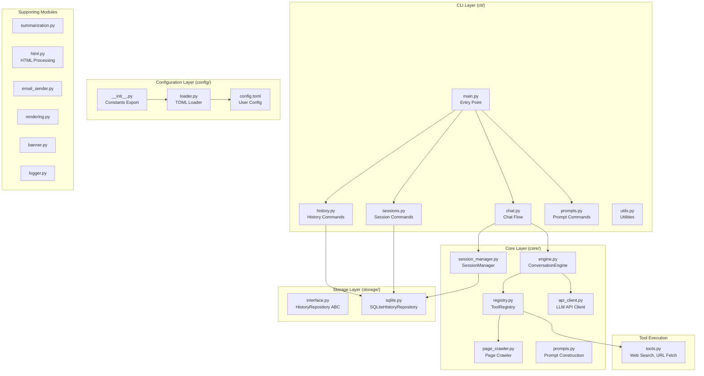

# asky Architecture

This document provides a comprehensive overview of the **asky** codebase architecture.

## High-Level Overview

asky is an AI-powered CLI tool that combines LLM capabilities with web search and tool-calling to provide intelligent, research-backed answers to queries.



---

## Package Structure

```
src/asky/
├── __init__.py         # Package initialization
├── __main__.py         # Module entry point
├── cli/                # Command-line interface layer
│   ├── __init__.py     # CLI exports
│   ├── main.py         # Argument parsing, entry point
│   ├── chat.py         # Chat conversation flow
│   ├── history.py      # History viewing/deletion commands
│   ├── sessions.py     # Session management commands
│   ├── prompts.py      # User prompt listing
│   └── utils.py        # Query expansion, config printing
├── core/               # Core conversation engine
│   ├── __init__.py     # Core exports
│   ├── engine.py       # ConversationEngine, tool registries
│   ├── registry.py     # ToolRegistry for tool management
│   ├── api_client.py   # LLM API calls, UsageTracker
│   ├── session_manager.py  # Session lifecycle, compaction
│   └── prompts.py      # System prompt construction
├── storage/            # Data persistence layer
│   ├── __init__.py     # Storage exports
│   ├── interface.py    # HistoryRepository ABC, Interaction dataclass
│   ├── sqlite.py       # SQLiteHistoryRepository implementation
│   └── session.py      # Session dataclass (legacy, merged into sqlite.py)
├── config/             # Configuration management
│   ├── __init__.py     # Constants export from TOML
│   └── loader.py       # TOML loading, config merging
├── config.toml         # Default configuration file
├── tools.py            # Tool execution (web search, URL fetch, custom tools)
├── summarization.py    # Query/answer summarization logic
├── html.py             # HTML stripping and link extraction
├── email_sender.py     # Email sending via SMTP
├── rendering.py        # Browser rendering of markdown
├── banner.py           # CLI banner display
├── logger.py           # Logging configuration
└── template.html       # HTML template for browser rendering
```

---

## Core Components

### 1. CLI Layer (`cli/`)

The CLI is modularized for maintainability:

| Module | Responsibility |
|--------|----------------|
| `main.py` | Argument parsing (`argparse`), command routing, banner display |
| `chat.py` | Main chat flow: context loading, message building, engine invocation |
| `history.py` | `-H`, `-pa`, `--delete-messages` commands |
| `sessions.py` | `-sH`, `-ps`, `--delete-sessions`, `--session-end` commands |
| `prompts.py` | `-p` command to list user prompts |
| `utils.py` | Query expansion (`/cp`, `/prompt_key`), verbose config printing |

#### Key CLI Flags

| Flag | Purpose |
|------|---------|
| `-m, --model` | Select model alias |
| `-c, --continue-chat` | Continue with context from previous IDs |
| `-s, --summarize` | Use summaries for context/URL content |
| `-H, --history [N]` | Show last N history entries |
| `-pa, --print-answer` | Print specific answer(s) by ID |
| `-ps, --print-session` | Print session content |
| `-ss, --sticky-session` | Start/resume persistent session |
| `--delete-messages` | Delete history records |
| `--delete-sessions` | Delete session records |
| `-o, --open` | Open result in browser |
| `--mail` | Send result via email |

---

### 2. Core Layer (`core/`)

#### ConversationEngine (`engine.py`)

The central orchestrator for multi-turn LLM conversations:

```python
class ConversationEngine:
    """Orchestrates multi-turn LLM conversations with tool execution."""
    
    def __init__(self, model_config, tool_registry, summarize, ...):
        # Initialize with model, tools, and optional session manager
        
    def run(self, messages: List[Dict]) -> str:
        # Main loop: send to LLM, parse tool calls, dispatch, repeat
        # Returns final answer after all tool calls complete
```

**Key Features:**
- Multi-turn tool execution loop (up to `MAX_TURNS`)
- Token usage tracking
- Integration with `SessionManager` for persistent sessions

#### ToolRegistry (`registry.py`)

Dynamic tool management for LLM function calling:

```python
class ToolRegistry:
    def register(name, schema, executor): ...
    def get_schemas() -> List[Dict]: ...  # For LLM payload
    def dispatch(call, summarize, usage_tracker, crawler_state): ...
```

**Tool Types:**
- **Built-in**: `web_search`, `get_url_content`, `get_url_details`
- **Custom**: User-defined in `config.toml` under `[tool.name]`

#### API Client (`api_client.py`)

Handles LLM API communication:

- `get_llm_msg()`: Send messages to LLM with retry logic
- `UsageTracker`: Track token usage per model alias
- `count_tokens()`: Naive token counting (chars / 4)

**Retry Logic:** Exponential backoff with `Retry-After` header support.

#### SessionManager (`session_manager.py`)

Manages persistent conversation sessions:

- **Sessions are Persistent**: Sessions never end - they are conversation threads that can be resumed anytime
- **Shell-Sticky Sessions**: Lock files in `/tmp/asky_session_{PID}` tie sessions to terminal instances
- **Auto-Naming**: When creating a session, names are auto-generated from query keywords (stopword filtering)
- **Duplicate Handling**: If multiple sessions match a name, user is prompted to select by ID
- **Context Compaction**: When context reaches threshold (default 80%), compacts history using:
  - `summary_concat`: Concatenate existing summaries (fast)
  - `llm_summary`: LLM-generated session summary (comprehensive)

---

### 3. Storage Layer (`storage/`)

#### Data Model

```python
@dataclass
class Interaction:
    id: Optional[int]
    timestamp: str
    session_id: Optional[int]  # NULL for history, set for session messages
    role: Optional[str]        # 'user' or 'assistant' for sessions
    content: str               # Message content
    query: str                 # For history (user message)
    answer: str                # For history (assistant message)
    summary: Optional[str]
    model: str
    token_count: Optional[int]
```

#### SQLiteHistoryRepository

Unified storage for both history and sessions:

**Tables:**
- `messages`: Unified table for all messages
  - `session_id IS NULL`: History entries (stored as paired rows)
  - `session_id IS NOT NULL`: Session messages
- `sessions`: Session metadata (id, name, model, created_at, compacted_summary)

**Key Methods:**
- `save_interaction()`: Save query/answer as two rows
- `get_history()`: Retrieve recent interactions
- `get_interaction_context()`: Build context string from IDs
- `delete_messages()` / `delete_sessions()`: Cascading deletion
- Session methods: `create_session`, `save_message`, `compact_session`, etc.

---

### 4. Configuration Layer (`config/`)

#### Loading Flow

1. `loader.py` loads bundled `config.toml` from package
2. Creates user config at `~/.config/asky/config.toml` if missing
3. Merges user config over defaults
4. Hydrates model definitions with API details

#### Key Configuration Sections

| Section | Purpose |
|---------|---------|
| `[general]` | Default model, timeouts, log settings, search provider |
| `[limits]` | Retry counts, snippet lengths, backoff settings |
| `[api.name]` | API endpoint definitions (URL, key) |
| `[models.alias]` | Model definitions referencing APIs |
| `[prompts]` | System prompt templates |
| `[user_prompts]` | User-defined shortcuts (`/gn`, `/wh`) |
| `[tool.name]` | Custom tool definitions |
| `[session]` | Compaction threshold and strategy |
| `[email]` | SMTP settings |

---

### 5. Tool Execution (`tools.py`)

#### Built-in Tools

| Tool | Purpose |
|------|---------|
| `web_search` | Search via SearXNG or Serper API |
| `get_url_content` | Fetch and strip HTML from URLs |
| `get_url_details` | Fetch content + extract links (Deep Dive) |

#### Custom Tools

Defined in `config.toml`:

```toml
[tool.list_dir]
command = "ls {flags} {path}"
description = "List directory contents."

[tool.list_dir.parameters]
type = "object"
required = ["path"]

[tool.list_dir.parameters.properties.path]
type = "string"
default = "."
```

Execution via `subprocess.run()` with argument quoting.

---

### 6. Supporting Modules

| Module | Purpose |
|--------|---------|
| `summarization.py` | Query/answer summarization using dedicated model |
| `html.py` | `HTMLStripper`: Remove scripts/styles, extract links |
| `email_sender.py` | Send results via SMTP (markdown → HTML conversion) |
| `rendering.py` | `render_to_browser()`: Open markdown in browser |
| `banner.py` | Display CLI banner with model info |
| `logger.py` | Configure file-based logging |

---

## Data Flow

### Standard Query Flow

```
User Query
    ↓
CLI (main.py) → parse_args()
    ↓
chat.py → load_context() → build_messages()
    ↓
ConversationEngine.run()
    ↓
┌─────────────────────────────────────┐
│ Multi-Turn Loop:                    │
│   1. Send messages to LLM           │
│   2. Parse tool calls (if any)      │
│   3. Dispatch via ToolRegistry      │
│   4. Append results to messages     │
│   5. Repeat until no more calls     │
└─────────────────────────────────────┘
    ↓
generate_summaries() → save_interaction()
    ↓
(Optional) render_to_browser() / send_email()
```

### Session Flow

```
asky -ss "my_session" <query>
    ↓
SessionManager.start_or_resume()
    ↓
build_context_messages() ← includes compacted_summary + recent messages
    ↓
ConversationEngine.run()
    ↓
SessionManager.save_turn()
    ↓
check_and_compact() → compact if > threshold
```

---

## Design Decisions

### 1. Unified Messages Table
The `messages` table serves dual purpose:
- **History entries**: `session_id IS NULL`, stored as paired User + Assistant rows
- **Session messages**: `session_id IS NOT NULL`, individual message rows

This consolidation simplifies storage while maintaining clear separation.

### 2. Shell-Sticky Sessions
Sessions are tied to terminal instances via lock files (`/tmp/asky_session_{PID}`), allowing automatic session resumption within the same terminal without requiring the `-ss` flag on every invocation.

### 3. Dynamic Tool Registry
Tools are registered dynamically at runtime, enabling:
- Different tool sets for different tasks
- Easy addition of custom user-defined tools
- Clean separation between tool definition and execution

### 4. Naive Token Counting
Uses `chars / 4` approximation instead of actual tokenizer, reducing dependencies while providing "good enough" estimates for context management.

---

## Testing

Tests are organized by component in `tests/`:

| Test File | Coverage |
|-----------|----------|
| `test_cli.py` | CLI argument parsing, command handlers |
| `test_storage.py` | Database operations, CRUD |
| `test_sessions.py` | Session lifecycle, compaction |
| `test_llm.py` | LLM API calls, conversation loop |
| `test_tools.py` | Tool execution, web search |
| `test_custom_tools.py` | Custom tool dispatch |
| `test_integration.py` | End-to-end flows |
| `test_page_crawler.py` | Deep dive page crawler |
| `test_html.py` | HTML stripping |
| `test_config.py` | Configuration loading |
| `test_email.py` | Email sending |
| `test_expansion.py` | Query expansion |

Run tests with:
```bash
uv run pytest
```

---

## Version Information

- **Python**: 3.10+
- **Key Dependencies**: `requests`, `rich`, `pyperclip`, `markdown`
- **Storage**: SQLite (local file at `~/.config/asky/history.db`)
- **Configuration**: TOML format
