# asky Architecture

This document provides a high-level overview of the **asky** codebase architecture. For detailed package documentation, see the `AGENTS.md` files in each subdirectory.

## Overview

asky is an AI-powered CLI tool that combines LLM capabilities with web search and tool-calling to provide intelligent, research-backed answers to queries.

```mermaid
graph TB
    subgraph API["Library API Layer (api/)"]
        api_types["types.py<br/>AskyConfig/TurnRequest/TurnResult"]
        api_client["client.py<br/>AskyClient Orchestration"]
        api_ctx["context.py<br/>History Context Resolution"]
        api_session["session.py<br/>Session Lifecycle Resolution"]
        api_preload["preload.py<br/>Local + Shortlist Preload Pipeline"]
        api_ex["exceptions.py<br/>Public Errors"]
    end

    subgraph CLI["CLI Layer (cli/)"]
        main["main.py<br/>Entry Point"]
        chat["chat.py<br/>Chat Flow"]
        local_ingest["local_ingestion_flow.py<br/>Pre-LLM Local Corpus Ingestion"]
        shortlist_flow["shortlist_flow.py<br/>Pre-LLM Shortlist Orchestration"]
        history["history.py<br/>History Commands"]
        sessions_cli["sessions.py<br/>Session Commands"]
        prompts_cli["prompts.py<br/>Prompt Commands"]
        utils["utils.py<br/>Utilities"]
    end

    subgraph Core["Core Layer (core/)"]
        engine["engine.py<br/>ConversationEngine"]
        tool_factory["tool_registry_factory.py<br/>Registry Construction"]
        registry["registry.py<br/>ToolRegistry"]
        llm_client["api_client.py<br/>LLM API Client"]
        session_mgr["session_manager.py<br/>SessionManager"]
        prompts_core["prompts.py<br/>Prompt Construction"]
    end

    subgraph Storage["Storage Layer (storage/)"]
        interface["interface.py<br/>HistoryRepository ABC"]
        sqlite["sqlite.py<br/>SQLiteHistoryRepository"]
    end

    subgraph Config["Configuration Layer (config/)"]
        config_init["__init__.py<br/>Constants Export"]
        loader["loader.py<br/>TOML Loader"]
    end

    subgraph Research["Research Mode (research/)"]
        cache["cache.py<br/>ResearchCache"]
        vector["vector_store.py<br/>VectorStore"]
        vector_ops["vector_store_*_ops.py<br/>Chunk/Link/Finding Ops"]
        vector_common["vector_store_common.py<br/>Shared Math/Constants"]
        shortlist["source_shortlist.py<br/>Pre-LLM Ranking"]
        shortlist_ops["shortlist_collect.py<br/>shortlist_score.py"]
    end

    subgraph Tools["Tool Execution"]
        tools["tools.py<br/>Web Search, URL Fetch"]
    end

    api_client --> api_ctx
    api_client --> api_session
    api_client --> api_preload
    api_client --> engine
    api_client --> session_mgr
    api_ctx --> sqlite
    api_session --> sqlite
    api_preload -.-> local_ingest
    api_preload -.-> shortlist
    main --> chat
    chat --> api_client
    main --> history
    main --> sessions_cli
    main --> prompts_cli
    chat --> engine
    chat --> tool_factory
    tool_factory --> registry
    engine --> registry
    engine --> llm_client
    chat --> session_mgr
    session_mgr --> sqlite
    history --> sqlite
    sessions_cli --> sqlite
    registry --> tools
    config_init --> loader
    shortlist_flow -.-> shortlist
    shortlist -.-> shortlist_ops
    vector -.-> vector_ops
    vector_ops -.-> vector_common
    chat -.-> cache
```



---

## Package Structure

```
src/asky/
├── api/                # Programmatic library API surface (run_turn orchestration)
├── cli/                # Command-line interface → see cli/AGENTS.md
├── core/               # Conversation engine → see core/AGENTS.md
├── storage/            # Data persistence → see storage/AGENTS.md
├── research/           # Research mode RAG → see research/AGENTS.md
├── evals/              # Manual integration eval harnesses (research + standard)
├── config/             # Configuration → see config/AGENTS.md
├── tools.py            # Tool execution (web search, URL fetch, custom)
├── retrieval.py        # Shared URL fetch + Trafilatura extraction
├── url_utils.py        # Shared URL sanitization/normalization helpers
├── lazy_imports.py     # Shared lazy import/call helper utilities
├── summarization.py    # Query/answer summarization
├── push_data.py        # HTTP data push to endpoints
├── html.py             # HTML stripping and link extraction
├── email_sender.py     # Email sending via SMTP
├── rendering.py        # Browser rendering of markdown
├── banner.py           # CLI banner display
└── logger.py           # Logging configuration
```

For test organization, see `tests/AGENTS.md`.

---

## Package Documentation

| Package | Documentation | Key Components |
|---------|---------------|----------------|
| `cli/` | [cli/AGENTS.md](src/asky/cli/AGENTS.md) | Entry point, chat flow, commands |
| `api/` | [api/AGENTS.md](src/asky/api/AGENTS.md) | `AskyClient`, turn orchestration services |
| `core/` | [core/AGENTS.md](src/asky/core/AGENTS.md) | ConversationEngine, ToolRegistry, API client |
| `storage/` | [storage/AGENTS.md](src/asky/storage/AGENTS.md) | SQLite repository, data model |
| `research/` | [research/AGENTS.md](src/asky/research/AGENTS.md) | Cache, vector store, embeddings |
| `evals/` | (manual harness) | Dual-mode research integration evaluation runner |
| `config/` | [config/AGENTS.md](src/asky/config/AGENTS.md) | TOML loading, constants |
| `tests/` | [tests/AGENTS.md](tests/AGENTS.md) | Test organization, patterns |

---

## Data Flow

### Standard Query Flow

```
User Query
    ↓
CLI (main.py) → parse_args()
    ↓
chat.py → build AskyTurnRequest + UI callbacks
    ↓
AskyClient.run_turn()
    ↓
context.py → resolve history selectors + context payload
    ↓
session.py → resolve create/resume/auto/research session state
    ↓
preload.py → optional local_ingestion + shortlist pipeline
    ↓
build_messages() (inside AskyClient)
    ↓
create ToolRegistry (mode-aware + runtime tool exclusions)
    ↓
append enabled tool guidelines to system prompt
    ↓
ConversationEngine.run()
    ↓
┌─────────────────────────────────────┐
│ Multi-Turn Loop:                    │
│   1. Send messages to LLM           │
│   2. Parse tool calls (if any)      │
│   3. Dispatch via ToolRegistry      │
│   4. Append results to messages     │
│   5. Repeat until no more calls     │
└─────────────────────────────────────┘
    ↓
generate_summaries() → persist (session/history)
    ↓
(Optional) render_to_browser() / send_email()
```

Programmatic consumers can bypass CLI by instantiating `AskyClient` directly and
calling `run_turn(...)` for full CLI-equivalent orchestration.

### Session Flow

```
asky -ss "my_session" <query>
    ↓
AskyClient.run_turn() → session.py
    ↓
resolve_session_for_turn()
    ↓
SessionManager.build_context_messages() / save_turn() / check_and_compact()
```

In research mode, session resolution auto-creates a session if none is active so
research-memory operations remain session-scoped for both CLI and API callers.

### Research Retrieval Flow

```
extract_links(urls, query?)
    ↓
ResearchCache.cache_url()
    ↓
VectorStore.store_chunk_embeddings()
    ↓
get_relevant_content(urls, query)
    ↓
Hybrid ranking: Chroma dense + SQLite BM25
    ↓
Top chunks returned with relevance scores
```

Local-file targets can enter the same flow through research adapters:
- built-in fallback accepts `local://...`, `file://...`, and direct local paths,
- directory discovery returns local file links,
- file reads (txt/html/md/json/csv and PDF/EPUB via PyMuPDF) are cached/indexed and retrieved via the same RAG path.

### Evaluation Harness Flow (Manual, Programmatic API)

```
Dataset (docs + tests) + Matrix (runs)
    ↓
prepare: pin local snapshots
    ↓
run: for each run profile
    ↓
runtime isolation (DB + Chroma + singleton reset)
    ↓
AskyClient.run_turn() per test case
    ↓
assertions (contains/regex)
    ↓
results.jsonl + results.md + summary.json + report.md
  - includes per-role token usage (`main`, `summarizer`, `audit_planner`)
  - emits run/case/external progress events for live CLI feedback
  - captures per-phase timing metrics (case, run, session)
  - captures tool-call breakdowns (tool type + arguments)
  - auto-generates fail-focused markdown case breakdowns from JSONL artifacts
  - report includes per-tool totals and per-run failure detail sections for single-file triage
```

### Research Memory Flow (Session-Scoped)

```
save_finding(...)
    ↓
chat research registry injects active session_id (when a session is active)
    ↓
ResearchCache.save_finding(..., session_id)
    ↓
VectorStore.store_finding_embedding()
    ↓
query_research_memory(query)
    ↓
VectorStore.search_findings(..., session_id=active_session)
    ↓
Semantic/fallback results filtered to current session scope
```

### Context Overflow Handling

`ConversationEngine` no longer performs interactive retries (`input()`) on HTTP 400
errors. It now raises `ContextOverflowError` (with compacted-message fallback data),
so callers (CLI/API/web) can choose retry/switch/fail behavior externally.

---

## Design Decisions

### 1. Unified Messages Table
History and session messages share the `messages` table:
- **History**: `session_id IS NULL`, stored as User + Assistant pairs
- **Sessions**: `session_id IS NOT NULL`, individual messages

### 2. Shell-Sticky Sessions
Sessions tied to terminal via lock files (`/tmp/asky_session_{PID}`) for automatic resumption.

### 3. Dynamic Tool Registry
Tools registered at runtime enabling:
- Different tool sets per task
- Easy custom tool addition
- Clean separation of definition and execution

### 4. Naive Token Counting
Uses `chars / 4` approximation for context management, avoiding tokenizer dependencies.

### 5. Hybrid Search (Dense + Lexical)
Research mode combines ChromaDB vectors for semantic search with SQLite FTS5 for BM25 lexical scoring.

### 6. Shared Source Shortlisting
Single implementation reused by research and standard chat modes with per-mode enablement flags.

### 7. Lazy Loading
Imports deferred until needed:
- Research cache only on compaction
- Tool executors on first use
- Argcomplete only when completing
- Shared helper utilities (`lazy_imports.py`) keep lazy bindings consistent across modules

### 8. Shared URL Normalization
- URL sanitization and canonical normalization are centralized in `url_utils.py`
- Retrieval, standard tools, research tools, and shortlist reuse the same helper logic

### 9. Registry Factory Separation
- `core/tool_registry_factory.py` owns default/research registry assembly
- `core/engine.py` now focuses on the conversation loop and context management

### 10. Research Module Decomposition
- `research/source_shortlist.py` keeps public API/orchestration while collection/scoring live in focused modules.
- `research/vector_store.py` keeps lifecycle and compatibility methods while heavy chunk/link/finding operations live in dedicated ops modules.

### 11. Bounded Hierarchical Summarization
- `summarization.py` uses a bounded map + single final reduce strategy for long content.
- This keeps hierarchical quality improvements while capping LLM round-trips to `chunk_count + 1`.

### 12. Tool Metadata-Driven Prompt Guidance
- Tool definitions can include `system_prompt_guideline` metadata (built-in, research, custom, push-data).
- `ToolRegistry` stores this metadata and emits:
  - API-safe tool schemas (`name`, `description`, `parameters`) for LLM tool-calling
  - Enabled-tool guideline lines for system prompt augmentation in chat flow.
- Runtime tool exclusions (`-off` / `-tool-off` / `--tool-off`) are applied during registry construction.

### 13. Session-Scoped Research Memory
- Research registry creation can inject active `session_id` into memory tools (`save_finding`, `query_research_memory`).
- Memory writes and reads can be isolated to the current chat session without adding extra user-facing tool parameters.

---

## Supporting Modules

| Module | Purpose |
|--------|---------|
| `summarization.py` | Bounded hierarchical summarization (map + single reduce) |
| `retrieval.py` | Shared URL retrieval via Trafilatura |
| `html.py` | HTML stripping, link extraction |
| `push_data.py` | HTTP data push to endpoints |
| `email_sender.py` | SMTP email sending |
| `rendering.py` | Browser markdown rendering |
| `banner.py` | CLI banner display |
| `logger.py` | Rotating file-based logging |

---

## Version Information

- **Python**: 3.10+
- **Key Dependencies**: `requests`, `rich`, `pyperclip`, `markdown`
- **Storage**: SQLite (local file at `~/.config/asky/history.db`)
- **Configuration**: TOML format
