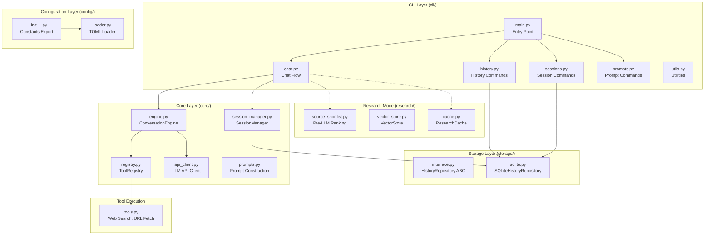

# asky Architecture

This document provides a high-level overview of the **asky** codebase architecture. For detailed package documentation, see the `AGENTS.md` files in each subdirectory.

## Overview

asky is an AI-powered CLI tool that combines LLM capabilities with web search and tool-calling to provide intelligent, research-backed answers to queries.



---

## Package Structure

```
src/asky/
├── cli/                # Command-line interface → see cli/AGENTS.md
├── core/               # Conversation engine → see core/AGENTS.md
├── storage/            # Data persistence → see storage/AGENTS.md
├── research/           # Research mode RAG → see research/AGENTS.md
├── config/             # Configuration → see config/AGENTS.md
├── tools.py            # Tool execution (web search, URL fetch, custom)
├── retrieval.py        # Shared URL fetch + Trafilatura extraction
├── summarization.py    # Query/answer summarization
├── push_data.py        # HTTP data push to endpoints
├── html.py             # HTML stripping and link extraction
├── email_sender.py     # Email sending via SMTP
├── rendering.py        # Browser rendering of markdown
├── banner.py           # CLI banner display
└── logger.py           # Logging configuration
```

For test organization, see `tests/AGENTS.md`.

---

## Package Documentation

| Package | Documentation | Key Components |
|---------|---------------|----------------|
| `cli/` | [cli/AGENTS.md](src/asky/cli/AGENTS.md) | Entry point, chat flow, commands |
| `core/` | [core/AGENTS.md](src/asky/core/AGENTS.md) | ConversationEngine, ToolRegistry, API client |
| `storage/` | [storage/AGENTS.md](src/asky/storage/AGENTS.md) | SQLite repository, data model |
| `research/` | [research/AGENTS.md](src/asky/research/AGENTS.md) | Cache, vector store, embeddings |
| `config/` | [config/AGENTS.md](src/asky/config/AGENTS.md) | TOML loading, constants |
| `tests/` | [tests/AGENTS.md](tests/AGENTS.md) | Test organization, patterns |

---

## Data Flow

### Standard Query Flow

```
User Query
    ↓
CLI (main.py) → parse_args()
    ↓
chat.py → load_context()
    ↓
optional source_shortlist.py (pre-LLM URL/search retrieval + ranking)
    ↓
build_messages()
    ↓
ConversationEngine.run()
    ↓
┌─────────────────────────────────────┐
│ Multi-Turn Loop:                    │
│   1. Send messages to LLM           │
│   2. Parse tool calls (if any)      │
│   3. Dispatch via ToolRegistry      │
│   4. Append results to messages     │
│   5. Repeat until no more calls     │
└─────────────────────────────────────┘
    ↓
generate_summaries() → save_interaction()
    ↓
(Optional) render_to_browser() / send_email()
```

### Session Flow

```
asky -ss "my_session" <query>
    ↓
SessionManager.start_or_resume()
    ↓
build_context_messages() ← includes compacted_summary + recent messages
    ↓
ConversationEngine.run()
    ↓
SessionManager.save_turn()
    ↓
check_and_compact() → compact if > threshold
```

### Research Retrieval Flow

```
extract_links(urls, query?)
    ↓
ResearchCache.cache_url()
    ↓
VectorStore.store_chunk_embeddings()
    ↓
get_relevant_content(urls, query)
    ↓
Hybrid ranking: Chroma dense + SQLite BM25
    ↓
Top chunks returned with relevance scores
```

---

## Design Decisions

### 1. Unified Messages Table
History and session messages share the `messages` table:
- **History**: `session_id IS NULL`, stored as User + Assistant pairs
- **Sessions**: `session_id IS NOT NULL`, individual messages

### 2. Shell-Sticky Sessions
Sessions tied to terminal via lock files (`/tmp/asky_session_{PID}`) for automatic resumption.

### 3. Dynamic Tool Registry
Tools registered at runtime enabling:
- Different tool sets per task
- Easy custom tool addition
- Clean separation of definition and execution

### 4. Naive Token Counting
Uses `chars / 4` approximation for context management, avoiding tokenizer dependencies.

### 5. Hybrid Search (Dense + Lexical)
Research mode combines ChromaDB vectors for semantic search with SQLite FTS5 for BM25 lexical scoring.

### 6. Shared Source Shortlisting
Single implementation reused by research and standard chat modes with per-mode enablement flags.

### 7. Lazy Loading
Imports deferred until needed:
- Research cache only on compaction
- Tool executors on first use
- Argcomplete only when completing

---

## Supporting Modules

| Module | Purpose |
|--------|---------|
| `summarization.py` | Hierarchical map-reduce summarization |
| `retrieval.py` | Shared URL retrieval via Trafilatura |
| `html.py` | HTML stripping, link extraction |
| `push_data.py` | HTTP data push to endpoints |
| `email_sender.py` | SMTP email sending |
| `rendering.py` | Browser markdown rendering |
| `banner.py` | CLI banner display |
| `logger.py` | Rotating file-based logging |

---

## Version Information

- **Python**: 3.10+
- **Key Dependencies**: `requests`, `rich`, `pyperclip`, `markdown`
- **Storage**: SQLite (local file at `~/.config/asky/history.db`)
- **Configuration**: TOML format
