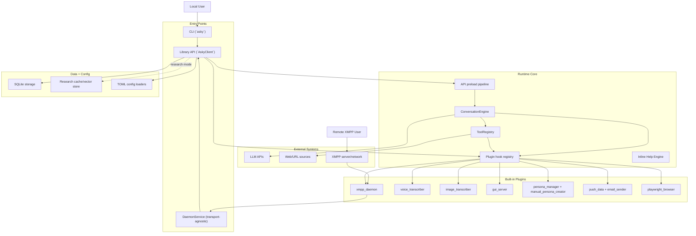
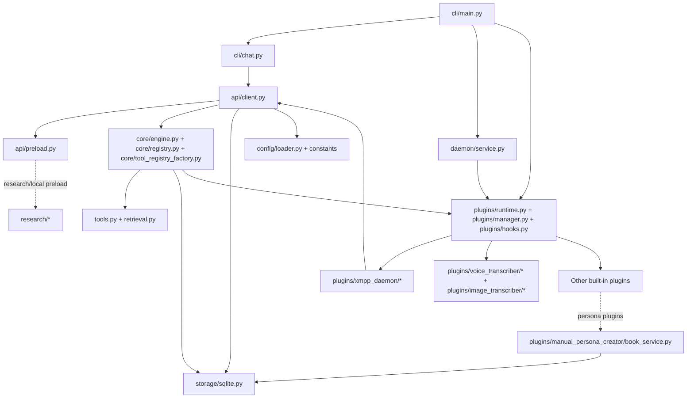
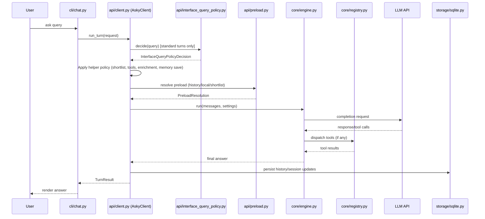
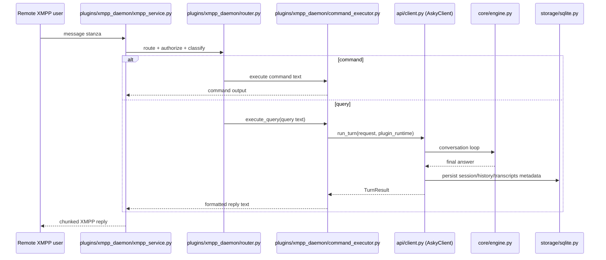

# asky Architecture

This document provides a high-level overview of the **asky** codebase architecture. For detailed package documentation, see the `AGENTS.md` files in each subdirectory.

## Overview

asky is an AI-powered CLI tool that combines LLM capabilities with web search and tool-calling to provide intelligent, research-backed answers to queries. It also includes an optional XMPP foreground daemon mode for remote command/query handling.

Current CLI routing supports a grouped command surface (`history/session/memory/corpus/prompts`) and a single config mutation entrypoint (`--config <domain> <action>`). `main.py` normalizes that surface into internal flags before dispatch.
Grouped domains use strict routing: recognized domain commands with missing/invalid subcommands no longer fall back to free-text queries. `session` with no subcommand shows session help plus active-shell session status, and `session show` without a selector targets the currently active shell session.

### View 1: System Context


```mermaid
graph TD
    user["Local User"]
    remote_user["Remote XMPP User"]

    subgraph EntryPoints["Entry Points"]
        cli["CLI (`asky`)"]
        api["Library API (`AskyClient`)"]
        daemon["DaemonService (transport-agnostic)"]
    end

    subgraph Runtime["Runtime Core"]
        preload["API preload pipeline"]
        engine["ConversationEngine"]
        registry["ToolRegistry"]
        hooks["Plugin hook registry"]
        help["Inline Help Engine"]
    end

    subgraph BuiltInPlugins["Built-in Plugins"]
        xmpp["xmpp_daemon"]
        voice["voice_transcriber"]
        image["image_transcriber"]
        gui["gui_server"]
        persona["persona_manager + manual_persona_creator"]
        delivery["push_data + email_sender"]
        browser["playwright_browser"]
    end

    subgraph DataAndConfig["Data + Config"]
        sqlite["SQLite storage"]
        research["Research cache/vector store"]
        config["TOML config loaders"]
    end

    subgraph External["External Systems"]
        llm["LLM APIs"]
        web["Web/URL sources"]
        xmpp_net["XMPP server/network"]
    end

    user --> cli
    cli --> api
    remote_user --> xmpp_net --> xmpp --> daemon
    daemon --> api

    api --> preload --> engine
    engine --> registry
    api --> hooks
    engine --> hooks
    registry --> hooks

    hooks --> xmpp
    hooks --> voice
    hooks --> image
    hooks --> gui
    hooks --> persona
    hooks --> delivery
    hooks --> browser

    api --> sqlite
    engine --> llm
    registry --> web
    api -. research mode .-> research
    api --> config
```

### View 2: Package Dependency Shape


```mermaid
graph TD
    main["cli/main.py"]
    chat["cli/chat.py"]
    daemon["daemon/service.py"]
    api["api/client.py"]
    preload["api/preload.py"]
    core["core/engine.py + core/registry.py + core/tool_registry_factory.py"]
    tools["tools.py + retrieval.py"]
    storage["storage/sqlite.py"]
    research["research/*"]
    plugin_rt["plugins/runtime.py + plugins/manager.py + plugins/hooks.py"]
    xmpp["plugins/xmpp_daemon/*"]
    transcribers["plugins/voice_transcriber/* + plugins/image_transcriber/*"]
    other_plugins["Other built-in plugins"]
    book_service["plugins/manual_persona_creator/book_service.py"]
    config["config/loader.py + constants"]

    main --> chat --> api
    main --> daemon
    main --> plugin_rt

    daemon --> plugin_rt
    plugin_rt --> xmpp
    plugin_rt --> transcribers
    plugin_rt --> other_plugins
    xmpp --> api
    
    other_plugins -. persona plugins .-> book_service
    book_service --> storage

    api --> preload
    api --> core
    api --> storage
    api --> config

    core --> tools
    core --> storage
    core --> plugin_rt
    preload -. research/local preload .-> research
```

### View 3: Runtime Sequences

CLI turn:


```mermaid
sequenceDiagram
    participant U as User
    participant CLI as cli/chat.py
    participant API as api/client.py (AskyClient)
    participant HELPER as api/interface_query_policy.py
    participant PRE as api/preload.py
    participant ENG as core/engine.py
    participant REG as core/registry.py
    participant LLM as LLM API
    participant DB as storage/sqlite.py

    U->>CLI: ask query
    CLI->>API: run_turn(request)
    API->>HELPER: decide(query) [standard turns only]
    HELPER-->>API: InterfaceQueryPolicyDecision
    API->>API: Apply helper policy (shortlist, tools, enrichment, memory save)
    API->>PRE: resolve preload (history/local/shortlist)
    PRE-->>API: PreloadResolution
    API->>ENG: run(messages, settings)
    ENG->>LLM: completion request
    LLM-->>ENG: response/tool calls
    ENG->>REG: dispatch tools (if any)
    REG-->>ENG: tool results
    ENG-->>API: final answer
    API->>DB: persist history/session updates
    API-->>CLI: TurnResult
    CLI-->>U: render answer
```

XMPP daemon turn:


```mermaid
sequenceDiagram
    participant XU as Remote XMPP user
    participant XS as plugins/xmpp_daemon/xmpp_service.py
    participant RT as plugins/xmpp_daemon/router.py
    participant CE as plugins/xmpp_daemon/command_executor.py
    participant API as api/client.py (AskyClient)
    participant ENG as core/engine.py
    participant DB as storage/sqlite.py

    XU->>XS: message stanza
    XS->>RT: route + authorize + classify
    alt command
        RT->>CE: execute command text
        CE-->>XS: command output
    else query
        RT->>CE: execute_query(query text)
        CE->>API: run_turn(request, plugin_runtime)
        API->>ENG: conversation loop
        ENG-->>API: final answer
        API->>DB: persist session/history/transcripts metadata
        API-->>CE: TurnResult
        CE-->>XS: formatted reply text
    end
    XS-->>XU: chunked XMPP reply
```

---

## Authored Books and Persona Service Layer

The `manual_persona_creator` plugin implements a structured **Authored Book** ingestion pipeline. This allows users to ingest long-form content (PDF, EPUB, Text) into a persona with high-fidelity extraction of viewpoints and claims.

### Key Architectural Components

- **Service Layer (`book_service.py`)**: A UI-agnostic orchestration layer that enforces business rules, identity guards, and coordinates preflight, ingestion, and inspection. It is designed to be reused by both CLI and future GUI/API surfaces.
- **Ingestion Pipeline (`book_ingestion.py`)**: A multi-pass process (Read → Summarize → Discover → Extract → Materialize) managed by a resumable `BookIngestionJob`.
- **Identity Guard**: Enforces canonical book identity (`book_key`) derived from title, year, and ISBN. `ingest-book` prevents overwriting completed books, while `reingest-book` allows replacement only when the identity matches.
- **Artifacts**:
    - `book.toml`: Confirmed metadata.
    - `viewpoints.json`: Extracted structured viewpoints with evidence.
    - `report.json`: Detailed ingestion report including warnings and per-stage timings.
    - `index.json`: Global index of ingested books for the persona.

### Interaction Flow

1. **Preflight**: Metadata lookup (OpenLibrary) and source analysis. Returns ranked candidates and proposed targets.
2. **Editable Preflight**: User confirms/edits metadata and extraction targets. Resuming a job also enters this mandatory step.
3. **Execution**: Multi-pass extraction with strict JSON validation and warning accumulation.
4. **Inspection**: Reusable queries for listing books, viewing reports, and searching viewpoints across the persona.

---

## Persona Runtime Answering Pipeline (Milestone 2)

The `persona_manager` plugin coordinates the grounded answering pipeline, ensuring that persona responses are backed by evidence from the knowledge catalog.

### Knowledge Layering

1.  **Canonical Catalog**: Managed by `manual_persona_creator`, this contains the source of truth for all persona knowledge (viewpoints, excerpts, chunks) in `persona_knowledge/sources.json` and `entries.json`.
2.  **Runtime Index**: A derived, rebuildable `persona_knowledge/runtime_index.json` containing embeddings and structured metadata. This index is automatically rebuilt on import or when knowledge changes.

### Structured Retrieval and Ranking

The runtime uses a structured planner (`runtime_planner.py`) that implements multi-level priority ranking:
*   **Kind Priority**: Viewpoints (highest) > Evidence Excerpts > Raw Chunks (fallback).
*   **Trust Priority**: Authored primary sources are preferred over user-supplied or unreviewed web content.
*   **Hydration**: Top viewpoints are automatically hydrated with their linked supporting evidence excerpts so the model sees both the worldview claim and the underlying evidence.

### Grounding Contract and Validation

The runtime enforces a strict response contract via system prompt extension and post-response validation:
*   **Exact Format**: Answers must include `Grounding:`, `Evidence:` (citing `[P1], [P2]`), and optionally `Current Context:` (citing `[W1], [W2]`).
*   **Validation**: If a response lacks required citations or uses incorrect grounding labels, it is automatically replaced with a safe fallback: *"I don't have enough grounded persona evidence to answer this reliably."*
*   **Current Context Attribution**: When live web tools are used during a persona turn, they must be attributed separately from the static persona knowledge. Synthesis of persona worldview with live events is validated as `bounded_inference`.

---

## Source-Aware Ingestion and Review (Milestone 3)

Milestone 3 expands personas beyond authored books by introducing a source-aware ingestion layer that handles various source kinds (biography, interview, article, etc.) with explicit review boundaries.

### Source-Kind Awareness

The ingestion pipeline varies its extraction strategy based on the source kind:
- **Biography/Autobiography**: Extracts viewpoints, facts, timeline events, and conflict candidates.
- **Interview**: Extracts persona-attributed knowledge with speaker-role metadata.
- **Short-form (Article, Essay, etc.)**: Extracts authored viewpoints and facts.

### Review and Promotion Flow

To preserve the trust boundary, certain source kinds (biography, interview) are review-gated:
1.  **Pending State**: Ingested sources are stored as durable bundles but do not influence persona answering.
2.  **Review**: Users can inspect extracted knowledge via `source-report`.
3.  **Promotion**: Explicit approval projects the knowledge into the canonical catalog and rebuilds the runtime index.

---

## Guided Web Scraping and Review (Milestone 4)

Milestone 4 extends persona knowledge acquisition to the public web with a review-first collection system.

### Key Architectural Components

- **Web Service Layer (`web_service.py`)**: UI-agnostic orchestration for starting, continuing, approving, and retracting web collections.
- **Web Collection Job (`web_job.py`)**: A bounded background job that fetches pages, manages a per-collection frontier, and filters for distinctness (including embedding similarity).
- **Review Boundary**: Scraped pages are staged in a `review_ready` state. They do not affect canonical persona knowledge until explicitly approved by the user.
- **Preview Extraction**: Uses LLM-driven classification and metadata extraction (viewpoints, facts, timeline) before review to assist the user.
- **Bundle Materialization**: Approved web pages materialize a real Milestone-3 source bundle (`ingested_sources/<source_id>/`) with local content, ensuring they join the same durable runtime and query surfaces as manual sources.
- **Stable Identity**: Web source IDs (`source:web:<hash>`) are derived from the normalized final URL, ensuring they stay stable even if content is updated.
- **Generic Retraction**: The persona service supports unprojecting knowledge and resetting source status back to pending/review_ready, with automatic index rebuilding.

### Data Layout

- `web_collections/<collection_id>/collection.toml`: Collection-level manifest and status.
- `web_collections/<collection_id>/frontier.json`: Current crawl frontier state (queue, seen, fetched).
- `web_collections/<collection_id>/pages/<page_id>/page.toml`: Page-level manifest and classification.
- `web_collections/<collection_id>/pages/<page_id>/content.md`: Normalized page content.
- `web_collections/<collection_id>/pages/<page_id>/preview.json`: LLM-extracted preview metadata.
- `web_collections/<collection_id>/pages/<page_id>/report.json`: Detailed fetch report with retrieval provenance.
4.  **Auto-Approval**: Authored primary short-form sources are automatically approved and projected on ingestion.

### Conflict Preservation

Contradictions between sources are preserved as linked conflict groups rather than being deduplicated. These are queryable via `asky persona conflicts`.

### Expanded Artifacts

- `ingested_sources/<source_id>/`: Durable source bundles containing metadata, viewpoints, facts, timeline, and conflicts.
- `persona_knowledge/conflict_groups.json`: Global store of approved contradictions.
- `source_ingestion_jobs/`: Resumable job scratch state (excluded from export).

The CLI uses a production-side help catalog (`src/asky/cli/help_catalog.py`) to render
curated help surfaces and define the discoverability contract that tests enforce.

### Help Surfaces

Three help surfaces provide different levels of detail:

- **Top-level curated help** (`asky --help`): Short grouped guide focusing on
  user-facing commands. Includes grouped commands, configuration, query options,
  plugin-contributed sections, and links to more detailed help.
- **Full help reference** (`asky --help-all`): Complete argparse-generated
  flag reference including all public flags (both core and plugin-contributed).
  This is the single source of truth for all CLI flags and their documentation.
- **Grouped command help** (e.g., `asky session --help`): Per-command
  detailed help for grouped operational domains (history, session, memory, corpus, prompts).
- **Persona help** (`asky persona --help`): Persona subcommand documentation.

### Discoverability Contract

Production code in `help_catalog.py` defines explicit discoverability requirements:

- Top-level short help must include: `asky persona --help`, `--continue-chat`,
  `--reply`, `--elephant-mode`, and `session delete`.
- `--help-all` must include all public top-level flags from `cli_surface.py`:
  `PUBLIC_TOP_LEVEL_FLAGS` and `PLUGIN_FLAGS`.
- Grouped commands must appear on their respective help pages:
  `history *` → `asky history --help`
  `session *` → `asky session --help`
  `memory *` → `asky memory --help`
  `corpus *` → `asky corpus --help` or specific corpus sub-help
  `prompts list` → top-level short help
- Persona subcommands must appear in `asky persona --help`:
  `PERSONA_SUBCOMMANDS` from `cli_surface.py`.

Tests in `test_help_discoverability.py` enforce this contract by checking each declared
public surface item appears in its assigned help surface.

### Plugin Flag Handling

Plugin-contributed flags (like `--daemon`, `--sendmail`, `--browser`) are
added to the parser via the plugin manager's `collect_cli_contributions()` method.
The plugin manager is bootstrapped on-demand for `--help-all` invocations to ensure
these flags appear in the full help output, both for the normal CLI entrypoint
and for direct `from asky.cli import parse_args` callers.

---

## Package Structure

```
src/asky/
├── api/                # Programmatic library API surface (run_turn orchestration)
├── cli/                # Command-line interface → see cli/AGENTS.md
├── daemon/             # Daemon lifecycle core: DaemonService, menubar launcher, tray abstraction
├── core/               # Conversation engine → see core/AGENTS.md
├── storage/            # Data persistence → see storage/AGENTS.md
├── research/           # Research mode RAG → see research/AGENTS.md
├── memory/             # Cross-session user memory → see memory/AGENTS.md
├── testing/            # Shared pytest/domain-selection helpers for local quality gates
├── plugins/            # Optional plugin runtime + built-in plugins (persona/gui/xmpp_daemon)
├── evals/              # Manual integration eval harnesses (research + standard)
├── config/             # Configuration → see config/AGENTS.md
├── tools.py            # Tool execution (web search, URL fetch, custom)
├── retrieval.py        # Shared URL fetch + Trafilatura extraction
├── url_utils.py        # Shared URL sanitization/normalization helpers
├── lazy_imports.py     # Shared lazy import/call helper utilities
├── summarization.py    # Query/answer summarization
├── push_data.py        # HTTP data push to endpoints
├── html.py             # HTML stripping and link extraction
├── email_sender.py     # Email sending via SMTP
├── rendering.py        # Browser rendering of markdown
├── banner.py           # CLI banner display
└── logger.py           # Logging configuration
```

For test organization, see `tests/AGENTS.md`.
For detailed test-lane wiring, isolation, and gating behavior, see
`tests/ARCHITECTURE.md`.
The test suite now mirrors this package layout under `tests/asky/` and keeps
cross-cutting suites in `tests/integration/`, `tests/performance/`, and
`tests/scripts/`.

Default pytest runs also load a shared feature-domain plugin from
`src/asky/testing/`. That plugin reads `[tool.asky.pytest_feature_domains]`
from `pyproject.toml`, inspects the current uncommitted git worktree, and
deselects configured heavy domain suites when no matching domain paths changed.
The initial shipped domain is `research`, scoped to the slower research-owned
lanes. If git state is unavailable, pytest falls back to running everything.
Runtime test sandboxes now live under `temp/test_home/` instead of `tests/`,
which keeps generated fake-HOME trees out of pytest directory traversal during
top-level `tests/` collection.

---

## Package Documentation

| Package     | Documentation                                     | Key Components                                                              |
| ----------- | ------------------------------------------------- | --------------------------------------------------------------------------- |
| `cli/`      | [cli/AGENTS.md](src/asky/cli/AGENTS.md)           | Entry point, chat flow, commands                                            |
| `daemon/`   | [daemon/AGENTS.md](src/asky/daemon/AGENTS.md)     | Transport-agnostic `DaemonService`, menubar launcher, `TrayApp` abstraction |
| `api/`      | [api/AGENTS.md](src/asky/api/AGENTS.md)           | `AskyClient`, turn orchestration services                                   |
| `core/`     | [core/AGENTS.md](src/asky/core/AGENTS.md)         | ConversationEngine, ToolRegistry, API client                                |
| `storage/`  | [storage/AGENTS.md](src/asky/storage/AGENTS.md)   | SQLite repository, data model                                               |
| `research/` | [research/AGENTS.md](src/asky/research/AGENTS.md) | Cache, vector store, embeddings                                             |
| `memory/`   | [memory/AGENTS.md](src/asky/memory/AGENTS.md)     | Cross-session user memory store, recall, tools                              |
| `plugins/`  | [plugins/AGENTS.md](src/asky/plugins/AGENTS.md)   | Plugin manager/runtime, hook registry, persona plugins, GUI server plugin   |
| `evals/`    | (manual harness)                                  | Dual-mode research integration evaluation runner                            |
| `config/`   | [config/AGENTS.md](src/asky/config/AGENTS.md)     | TOML loading, constants                                                     |
| `tests/`    | [tests/AGENTS.md](tests/AGENTS.md)                | Test organization, patterns                                                 |

---

## Data Flow

### Standard Query Flow

```
User Query
    ↓
CLI (main.py) → parse args (`-r` corpus pointers + `--shortlist` override)
    ↓
optional plugin runtime init (`plugins/runtime.py`) from `~/.config/asky/plugins.toml`
    ↓
chat.py → build AskyTurnRequest + UI callbacks
    ↓
AskyClient.run_turn()
    ↓
context.py → resolve history selectors + context payload
    ↓
session.py → resolve create/resume/auto/research session state
    ↓
emit `SESSION_RESOLVED` plugin hook
    ↓
preload.py → optional local_ingestion + shortlist pipeline
           → shared adaptive shortlist policy for local-corpus turns:
             deterministic intent first (`web` vs `local`), interface-model fallback only for ambiguous intent
             with `research_source_mode=local_only` forcing shortlist off
           → [NEW] query classification (research mode only)
              - analyze query keywords and corpus size
              - determine mode: one_shot | research
              - adjust system prompt guidance accordingly
           → research-mode deterministic bootstrap retrieval over preloaded corpus handles
             (triggered when usable corpus is available, including cached follow-up turns)
           → standard-mode seed URL content preload (budget-aware)
    ↓
retrieval.py (fetch_url_document) → emit `FETCH_URL_OVERRIDE` plugin hook
    ↓
emit `PRE_PRELOAD` / `POST_PRELOAD` plugin hooks
    ↓
build_messages() (inside AskyClient)
    ↓
apply `SYSTEM_PROMPT_EXTEND` chain hook
    ↓
create ToolRegistry (mode-aware + runtime tool exclusions)
    ↓
emit `TOOL_REGISTRY_BUILD` plugin hook
    ↓
apply optional config-driven prompt text overrides for built-in tools
    ↓
append enabled tool guidelines to system prompt
    ↓
ConversationEngine.run()
    ↓
┌─────────────────────────────────────┐
│ Multi-Turn Loop:                    │
│   1. Send messages to LLM           │
│   2. `PRE_LLM_CALL` / `POST_LLM_RESPONSE` hooks
│   3. Parse tool calls (if any)      │
│   4. Dispatch via ToolRegistry (`PRE_TOOL_EXECUTE` / `POST_TOOL_EXECUTE`) │
│   5. Append results to messages     │
│   6. Repeat until no more calls     │
│   7. If max turns reached, force tool-free graceful-exit final call;         │
│      retry once on empty final content, then emit deterministic fallback text │
└─────────────────────────────────────┘
    ↓
emit `TURN_COMPLETED` plugin hook
    ↓
generate_summaries() → persist (session/history)
    ↓
(Optional) render_to_browser() / send_email()
```

`main.py` also exposes deterministic no-main-model corpus utilities:

- `--query-corpus` → `cli/research_commands.py`
- `--summarize-section` (+ `--section-source`, `--section-id`, `--section-include-toc`, `--section-detail`, `--section-max-chunks`) → `cli/section_commands.py`

Local section workflows now use canonical section references:

- `list_sections` defaults to canonical body sections (TOC/micro duplicates hidden),
- each row includes `section_ref` (`corpus://cache/<id>#section=<section-id>`),
- retrieval tools also accept compatibility legacy section-suffixed sources
  (`corpus://cache/<id>/<section-id>`) while explicit `section_ref`/`section_id`
  is the preferred contract.
- CLI positional `--summarize-section <value>` is interpreted as section query text
  (`SECTION_QUERY`), not section ID; deterministic ID selection requires
  `--section-id <section-id>`.

Shortlist policy matrix (effective runtime):

- Standard mode (no `-r`): shortlist follows lean/request/model/global policy.
- Research `web_only`: shortlist follows lean/request/model/global policy.
- Research `local_only`: shortlist is always disabled (hard gate), even with request override.
- Research `mixed`: shortlist uses adaptive intent policy
  (deterministic intent first, interface-model fallback only for ambiguous intent).
- Deterministic corpus command paths (`--query-corpus`, `corpus query`, section summarize)
  do not execute shortlist stage.

Rationale for `local_only` hard gate: this profile is an explicit corpus-only contract;
preload avoids speculative web candidate expansion and keeps retrieval grounded in the
already-ingested local corpus handles.

Verbose tracing has two levels:

- `-v`: existing verbose diagnostics (tool-call traces, shortlist traces, debug-friendly status output).
- `-vv`: includes `-v` behavior and additionally prints fully expanded main-model
  I/O payloads in boxed console output:
  - outbound request messages sent to the main model (all roles, full bodies),
  - inbound response messages returned by the main model (including tool-call payloads).
    In Live-banner mode these traces stream immediately through the live console
    (no end-of-turn deferral). Tool/summarization internals are shown as transport
    metadata (target endpoint, response status/type, and response size), not full bodies.
    Main-model transport request/response metadata is merged into the main request/response
    boxes (not duplicated as separate transport panels), outbound request payload traces
    include structured enabled-tool schemas/guidelines, and preload stage emits a
    structured `Preloaded Context Sent To Main Model` provenance panel before the first
    model call.

Programmatic consumers can bypass CLI by instantiating `AskyClient` directly and
calling `run_turn(...)` for full CLI-equivalent orchestration.

In standard mode, when prompts include URL(s), preload now injects a
`Seed URL Content from Query` block ahead of shortlist-ranked snippets. This
block is capped to a combined 80% model-context budget and marks each URL block
as `full_content`, `summarized_due_budget`, `summary_truncated_due_budget`, or
`fetch_error`. Prompt URL extraction supports both explicit `http(s)://...` and
bare-domain forms (`example.com/path`), and explicit prompt URLs are always
included in the shortlist context section even when ranked below the normal
top-k snippet cutoff. When seed URL content is complete (`full_content` and
within budget), message assembly switches to direct-answer guidance instructing
the model not to refetch the same URL unless freshness/completeness checks are
explicitly needed. In this direct-answer mode, standard retrieval tools
(`web_search`, `get_url_content`, `get_url_details`) are also disabled for that
turn to enforce single-pass answering from preloaded seed content.

### XMPP Daemon Flow

```
asky --daemon
    ↓
macOS + rumps available:
  cli/main.py
    -> singleton probe (`menubar.lock`) before spawn
    -> if running: print clear error, exit code 1
    -> if not running: spawn `--menubar-child`
  daemon/menubar.py → MacosTrayApp (status bar app)
    -> child acquires singleton lock before creating `rumps.App`
    -> tray startup initializes dedicated XMPP logging (`~/.config/asky/logs/xmpp.log`)
  menubar controls daemon/service.py lifecycle
otherwise:
  daemon/service.py (DaemonService, foreground)
    -> fires DAEMON_TRANSPORT_REGISTER → xmpp_daemon plugin registers XMPPService
    -> fires DAEMON_SERVER_REGISTER → gui_server etc. register sidecar servers
    -> calls XMPPService.run() (blocking)
    ↓
xmpp_service.py message callback payload
    ↓
per-conversation queue (serialized processing)
    ↓
router.py guards:
  - chat: sender allowlist (bare JID wildcard or exact full-JID)
  - groupchat: room must be pre-bound or trusted-invited
  - ad-hoc IQ commands: authorize full JID first, then bare JID fallback;
    multi-step flows reuse session-cached sender identity if follow-up IQ
    lacks a usable `from` field
    ↓
Routing:
  - trusted room invite:
      auto-bind room -> persistent session
      auto-join room
  - uploaded config TOML (OOB URL or inline fenced TOML):
      validate supported files (`general.toml`, `user.toml`)
      apply session-scoped overrides (last write wins, no merge)
      ignore unsupported keys with warning
  - uploaded document URLs (OOB/body):
      detect supported local-ingestion extensions
      enforce HTTPS + size/type limits
      dedupe globally by content hash
      link documents to the active session
      persist session research profile as local corpus (`local_only`)
      preload linked files via local-ingestion pipeline
  - /session command surface:
      /session, /session new, /session child, /session <id|name>
      switches conversation's active session
  - with interface model:
      prefixed text -> direct command
      non-prefixed text -> interface planner (configurable system prompt + command reference) -> command/query action
  - without interface model:
      command-like text -> command
      otherwise -> query
    ↓
command_executor.py
  - remote policy gate
  - transcript command namespace
  - query progress adapter emits reusable start/update/done events
  - AskyClient.run_turn() for query execution
    ↓
query_progress.py + xmpp_service.py
  - ad-hoc query nodes return immediate confirmation only
  - final LM/query results are delivered as normal chat messages
  - status updates are sent as one mutable message (XEP-0308 correction when available,
    append fallback when unavailable), throttled to ~2s
    ↓
optional media pipelines:
  oob/pasted audio URL -> background worker -> mlx-whisper -> transcript persistence
  oob/pasted image URL -> background worker -> base64 prompt -> image-capable model -> transcript persistence
    ↓
chunked outbound chat replies
```

Command presets are expanded at ingress (`\\name`, `\\presets`) before command execution, and remote policy is enforced after expansion/planning so blocked flags cannot be bypassed.
XMPP outbound formatting extracts markdown pipe tables before send and currently renders through the existing in-band ASCII-table fallback path. Client-identity capability mapping (`[xmpp_client.capabilities]`) and XEP-0030 discovery/token parsing are retained for future client-specific behavior controls.
For single-chunk outbound messages, the transport can now attach XHTML-IM payloads (with plain-body fallback) so setext/ATX markdown headers render as bold in supporting clients. When XHTML is attached, the plain fallback body is normalized from the same source (header markers/emphasis stripped) to keep both payloads semantically aligned and readable even if rich rendering is ignored.
Ad-hoc `Run Prompt` / `Run Query` / `Use Transcript` and `Run Preset` (only when preset resolves to LM query) execute asynchronously through the same per-conversation queue as text messages; ad-hoc IQ response remains a confirmation note while final answer arrives in chat.
XMPP query ingress applies the same recursive slash-expansion behavior as CLI (`/alias`, `/cp`) before model execution, and unresolved slash queries follow CLI prompt-list semantics (`/` lists all prompts, unknown `/prefix` returns filtered prompt listing). This shared query-prep path is used by direct text queries, interface-planned query actions, and `transcript use` query execution.
Daemon query prep also supports session-scoped media pointers: `#aN`/`#atN` for audio file+transcript and `#iN`/`#itN` for image file+transcript.
Room bindings and session override files are persisted in SQLite; on daemon startup/session-start, previously bound rooms are auto-rejoined and continue with their last active bound sessions.
On macOS menubar builds, the menu is assembled dynamically from plugin-contributed entries (via `TRAY_MENU_REGISTER`). The XMPP plugin contributes: XMPP status, JID, Voice status rows + Start/Stop XMPP and Voice toggle action rows. The GUI server plugin contributes: Start/Stop Web GUI and Open Settings action rows. Core fixed items are: startup-at-login status/action and Quit. XMPP credential/allowlist editing is CLI-only via `--config daemon edit` (no menubar credential editor).

### Session Flow

```
asky -ss "my_session" <query>
    ↓
AskyClient.run_turn() → session.py
    ↓
resolve_session_for_turn()
    ↓
SessionManager.build_context_messages() / save_turn() / check_and_compact()
```

Session resolution now owns effective research profile state:

- sessions persist `research_mode`, `research_source_mode`, and `research_local_corpus_paths`,
- resumed research sessions keep research behavior even when `-r` is omitted,
- `-r` on an existing non-research session promotes and persists that session as research,
- new `-r` corpus pointers replace stored session corpus pointers.

Sessions also persist query-behavior defaults (`sessions.query_defaults` JSON) for CLI flags like model/tool disables/system prompt; shortlist override remains first-class in `sessions.shortlist_override`.
Defaults-only invocations can auto-create unnamed sessions, which are marked for deferred auto-rename and renamed from the first real query.
Session research cleanup (`session clean-research` / `--clean-session-research`) removes session-scoped findings/embeddings, clears session-linked uploaded document associations, and resets persisted local corpus path pointers for that session. It does not directly purge shared `research_cache`/chunk/link rows or global uploaded-document artifacts.
Session deletion (`session delete`) performs the same implicit research cleanup (findings/vectors and upload links) before removing matches from the session and messages tables.
TODO: add a dedicated forceful research-cache purge command for explicit operator-triggered cache deletion.

If no session is active and effective research mode is requested, a research
session is auto-created so research-memory operations remain session-scoped.

### Research Retrieval Flow

```
extract_links(urls, query?)
    ↓
ResearchCache.cache_url()
    ↓
VectorStore.store_chunk_embeddings()
    ↓
get_relevant_content(urls, query)
    ↓
Hybrid ranking: Chroma dense + SQLite BM25
    ↓
Top chunks returned with relevance scores
    ↓
Evidence Extraction (optional)
    ↓
Structured facts injected into context
```

Document summaries are generated on-demand and synchronously via `get_link_summaries` when needed.
The CLI no longer performs an end-of-turn background-summary drain for research turns.
Research cache entries are global to the active DB path and expire by TTL (`research.cache_ttl_hours`, default 24h). Re-ingestion refreshes TTL/content for matching cache keys by design.

Local-file targets are preloaded/indexed through a built-in local loader:

- local loading is gated by `research.local_document_roots`,
- absolute paths ingest only when inside configured roots (unless `research.allow_absolute_paths_outside_roots` is true),
- ingested extensions are restricted to an explicitly configured global allowlist (`research.allowed_ingestion_extensions`), if not empty,
- root-relative corpus paths resolve under configured roots,
- directory discovery returns local file links, and file reads
  (txt/html/md/json/csv and PDF/EPUB via PyMuPDF) are cached/indexed.

Guardrail: generic LLM-facing URL/content tools reject local filesystem targets; local-source access should happen via explicit local-source tooling workflows.

Prompt guardrail: when local targets are detected for preload, model-visible user
query text is path-redacted and research system guidance adds an explicit
`query_research_memory` local-knowledge-base retrieval hint.

### Evaluation Harness Flow (Manual, Programmatic API)

```
Dataset (docs + tests) + Matrix (runs)
    ↓
prepare: pin local snapshots
    ↓
run: for each run profile
    ↓
runtime isolation (DB + Chroma + singleton reset)
    ↓
AskyClient.run_turn() per test case
    ↓
assertions (contains/regex)
    ↓
results.jsonl + results.md + summary.json + report.md
  - includes per-role token usage (`main`, `summarizer`, `audit_planner`)
  - emits run/case/external progress events for live CLI feedback
  - captures per-phase timing metrics (case, run, session)
  - captures tool-call breakdowns (tool type + arguments)
  - auto-generates fail-focused markdown case breakdowns from JSONL artifacts
  - report includes per-tool totals and per-run failure detail sections for single-file triage
```

### Research Memory Flow (Session-Scoped)

Findings and embeddings are isolated by `session_id`. Selective cleanup via `--clean-session-research` removes these records for a session while preserving conversation history. Session deletion (`session delete`) now implicitly runs this same research cleanup path before the session itself is removed.

```
save_finding(...)
    ↓
chat research registry injects active session_id (when a session is active)
    ↓
ResearchCache.save_finding(..., session_id)
    ↓
VectorStore.store_finding_embedding()
    ↓
query_research_memory(query)
    ↓
VectorStore.search_findings(..., session_id=active_session)
    ↓
Semantic/fallback results filtered to current session scope
```

### User Memory Flow

```
Every Turn (non-lean):
    memory/recall.py → has_any_memories()? → embed query → search user_memories
    ↓
    Top-K results (cosine ≥ 0.35) injected as "## User Memory" into system prompt

Explicit Save (save_memory tool):
    LLM calls save_memory → execute_save_memory()
    ↓
    find_near_duplicate() (cosine ≥ 0.90) → update existing OR insert new
    ↓
    store_memory_embedding() → SQLite BLOB + Chroma upsert

Session Auto-Extraction (--elephant-mode):
    After run_turn() completes → daemon thread
    ↓
    auto_extract.py → LLM extracts JSON facts from query+answer
    ↓
    execute_save_memory() for each fact (dedup built in)
```

### Context Overflow Handling

`ConversationEngine` no longer performs interactive retries (`input()`) on HTTP 400
errors. It now raises `ContextOverflowError` (with compacted-message fallback data),
so callers (CLI/API/web) can choose retry/switch/fail behavior externally.

---

## Design Decisions

### 1. Unified Messages Table

History and session messages share the `messages` table:

- **History**: `session_id IS NULL`, stored as User + Assistant pairs
- **Sessions**: `session_id IS NOT NULL`, individual messages

CLI history operations (`history list/show/delete`) resolve against the same unified
table and do not distinguish by `session_id`; pairing/expansion is constrained to
same-session scope when linking user/assistant partner rows.

### 2. Shell-Sticky Sessions

Sessions tied to terminal via lock files (`/tmp/asky_session_{PID}`) for automatic resumption.

### 3. Dynamic Tool Registry

Tools registered at runtime enabling:

- Different tool sets per task
- Easy custom tool addition
- Clean separation of definition and execution

### 4. Naive Token Counting

Uses `chars / 4` approximation for context management, avoiding tokenizer dependencies.

### 5. Hybrid Search (Dense + Lexical)

Research mode combines ChromaDB vectors for semantic search with SQLite FTS5 for BM25 lexical scoring.

### 6. Shared Source Shortlisting

Single implementation reused by research and standard chat modes with per-mode enablement flags.
When a local corpus is preloaded (documents ingested before shortlisting), the pipeline
becomes corpus-aware: `corpus_context.py` extracts document titles and YAKE keyphrases
from lead text, then enriches web search queries with corpus metadata. In `local_only`
mode, web search is skipped entirely and corpus documents are injected as shortlist
candidates directly. In mixed mode, corpus candidates are scored alongside web candidates
through the same embedding pipeline.

### 7. Lazy Loading

Imports deferred until needed, with two distinct patterns:

- **Truly deferred**: `research_cache` — imported and instantiated only when compaction calls for cached summaries.
- **Eager registration, closure-captured imports**: tool executors — registered at registry construction time as closures; the closure body captures module-level imports, so the module is loaded at construction, but the executor logic runs only when the tool is actually called.
- **Truly deferred**: `argcomplete` — imported only when the `_ARGCOMPLETE` env var is present.
- Shared helper utilities (`lazy_imports.py`) keep lazy bindings consistent across modules.

### 8. Shared URL Normalization

- URL sanitization and canonical normalization are centralized in `url_utils.py`
- Retrieval, standard tools, research tools, and shortlist reuse the same helper logic

### 9. Registry Factory Separation

- `core/tool_registry_factory.py` owns default/research registry assembly
- `core/engine.py` now focuses on the conversation loop and context management

### 10. Research Module Decomposition

- `research/source_shortlist.py` keeps public API/orchestration while collection/scoring live in focused modules.
- `research/vector_store.py` keeps lifecycle and compatibility methods while heavy chunk/link/finding operations live in dedicated ops modules.

### 11. Bounded Hierarchical Summarization

- `summarization.py` uses a bounded map + single final reduce strategy for long content.
- This keeps hierarchical quality improvements while capping LLM round-trips to `chunk_count + 1`.
- `summarizer.hierarchical_chunk_target_chars` supports sentinel `0`, which auto-resolves
  to the summarization input limit derived from summarization-model context settings.

### 12. Tool Metadata-Driven Prompt Guidance

- Tool definitions can include `system_prompt_guideline` metadata (built-in, research, custom, push-data).
- `ToolRegistry` stores this metadata and emits:
  - API-safe tool schemas (`name`, `description`, `parameters`) for LLM tool-calling
  - Enabled-tool guideline lines for system prompt augmentation in chat flow.
- Runtime tool exclusions (`-off` / `-tool-off` / `--tool-off`) are applied during registry construction.

### 13. Session-Scoped Research Memory

- Research registry creation can inject active `session_id` into memory tools (`save_finding`, `query_research_memory`).
- Memory writes and reads can be isolated to the current chat session without adding extra user-facing tool parameters.

---

## Supporting Modules

| Module             | Purpose                                                                              |
| ------------------ | ------------------------------------------------------------------------------------ |
| `summarization.py` | Bounded hierarchical summarization (map + single reduce)                             |
| `retrieval.py`     | Shared URL retrieval via Trafilatura                                                 |
| `html.py`          | HTML stripping, link extraction                                                      |
| `push_data.py`     | HTTP data push to endpoints                                                          |
| `email_sender.py`  | SMTP email sending                                                                   |
| `rendering.py`     | Browser markdown rendering + Sidebar Index App Generation                            |
| `banner.py`        | CLI banner display                                                                   |
| `logger.py`        | Rotating file-based logging with startup timestamp rollover (`asky.log`, `xmpp.log`) |

---

### 14. Corpus-Aware Tool Exposure

To optimize LLM tool usage, especially for smaller models, research tools are logically split into **Acquisition** (extracting and caching new data) and **Retrieval** (searching within already cached data) sets.

When a corpus has been pre-built by acquisition stages (local ingestion or web shortlist), `AskyClient` dynamically excludes acquisition tools from the model's tool registry. This prevents models from wasting turns attempting to re-fetch or explore URLs that are already indexed, forcing them to focus on high-value retrieval and synthesis.

A simplified "retrieval-only" system prompt guidance is injected in these cases to reflect the pre-loaded state.

---

## Version Information

- **Python**: 3.10+
- **Key Dependencies**: `requests`, `rich`, `pyperclip`, `markdown`
- **Optional Daemon Dependencies**: `slixmpp` (XMPP), `mlx-whisper` (voice transcription), `rumps` (macOS menubar)
- **Storage**: SQLite (local file at `~/.config/asky/history.db`)
- **Configuration**: TOML format

### Decision 15: Pre-retrieval Query Expansion

- **Context**: Complex research queries often cover multiple topics, making single-pass search retrieval suboptimal.
- **Decision**: Introduce a query expansion stage before retrieval.
- **Implementation**:
  - Deterministic mode uses YAKE for keyphrase clustering.
  - LLM mode (optional) uses a small structured-output call.
  - `PreloadResolution` stores sub-queries; shortlist and local ingestion use them for multi-pass retrieval.

### Decision 16: Cross-Session User Memory

- **Context**: Users want the LLM to remember persistent preferences and facts across separate invocations.
- **Decision**: Global `user_memories` table + separate Chroma collection (`asky_user_memories`) decoupled from session/research state.
- **Implementation**:
  - `memory/store.py` — pure SQLite CRUD for `user_memories`.
  - `memory/vector_ops.py` — embedding storage and cosine-similarity search (Chroma primary, SQLite BLOB fallback).
  - `memory/recall.py` — query-time recall injected as `## User Memory` section in system prompt (runs in all modes unless `lean`).
  - `memory/tools.py` — `save_memory` LLM tool available in all registries; dedup via cosine threshold (0.90).
  - `memory/auto_extract.py` — session-scoped background extraction when `--elephant-mode` is active.
- **Key invariants**:
  - Memory recall short-circuits if no embeddings exist (`has_any_memories()`).
  - Memory is always **global** (not scoped to session or research mode).
  - Auto-extraction runs in a daemon thread; never blocks response delivery.
  - `--elephant-mode` requires an active session (`-ss` / `-rs`); otherwise ignored with a warning.

### Decision 17: Evidence-Focused Extraction

- **Context**: Raw chunks are often noisy; smaller models benefit from structured facts.
- **Decision**: Add a post-retrieval fact extraction step using a focused LLM prompt.
- **Implementation**:
  - Optional stage in `run_preload_pipeline` (enabled via `research.toml`).
  - Processes top-k retrieved chunks (max 10).
  - Produces structured JSON facts injected as a "Structured Evidence" section in the user prompt.

### Decision 18: Session-Persistent Max Turns

- **Context**: Users need control over turn limits for specific complex sessions (e.g., long research or deep debugging) without changing global app defaults.
- **Decision**: Introduce a session-level `max_turns` setting that can be overridden via CLI and persists in the database.
- **Implementation**:
  - `storage/sqlite.py` — `sessions` table includes `max_turns` column.
  - `api/session.py` — `resolve_session_for_turn` calculates effective turn limit (CLI override > session setting > model default).
  - `core/engine.py` — `ConversationEngine` loop uses the dynamic turn limit provided at instantiation.
  - CLI banner reflects the effective turn count (e.g., `Turns: 2/5`).
- **Key invariants**:
  - Passing `-t` / `--turns` while a session is active (or being created) overwrites the persisted setting for that session.
  - Subsequent resumes of that session automatically use the last-set turn limit.

### Decision 19: Local-Only Plugin Runtime (v1)

- **Context**: Feature extensions (persona workflows, daemon sidecars, future extractions) should be composable without hard-coding every capability into core CLI/daemon loops.
- **Decision**: Introduce an optional local-only plugin runtime loaded from `~/.config/asky/plugins.toml`, with deterministic hook ordering and per-plugin failure isolation.
- **Implementation**:
  - `plugins/manifest.py` + `plugins/manager.py` — roster parsing, dependency graph ordering, import/activation/deactivation.
  - `plugins/hooks.py` + `plugins/hook_types.py` — thread-safe ordered registry and typed mutable hook payloads.
  - `plugins/runtime.py` — process-level runtime bootstrap + cache.
  - Hook plumbing across `api/client.py`, `core/tool_registry_factory.py`, `core/engine.py`, and `core/registry.py`.
  - CLI/daemon runtime injection in `cli/main.py`, `cli/chat.py`, `daemon/service.py`.
- **Key invariants**:
  - No enabled plugins means behavior stays identical to pre-plugin baseline.
  - Plugin load/activation failures never crash normal chat/daemon execution.
  - Hook order is deterministic: `(priority, plugin_name, registration_index)`.
  - Deferred hooks (`CONFIG_LOADED`, `SESSION_END`) remain unimplemented in v1.

### Decision 21: Plugin-Contributed Tray Entries + Dependency Visibility

- **Context:** `TrayController` knew about XMPP and GUI server specifically. Dependency failures were silently logged. No way to distinguish launch context for gating interactive prompts.
- **Decision:** Core tray has zero transport/plugin knowledge. Each plugin contributes menu entries via `TRAY_MENU_REGISTER`. Dependency issues surface as interactive prompts (CLI) or tray warnings (daemon/app). `LaunchContext` enum gates interactive behaviour.
- **Implementation:**
  - `daemon/launch_context.py` — `LaunchContext` enum + module-level get/set/is_interactive.
  - `daemon/tray_protocol.py` — `TrayPluginEntry` (callable label + optional action + optional autostart) + slimmed `TrayStatus`.
  - `plugins/hook_types.py` — `TRAY_MENU_REGISTER` + `TrayMenuRegisterContext` (status_entries, action_entries, service callbacks).
  - `daemon/tray_controller.py` — fires `TRAY_MENU_REGISTER` at init; generic `start/stop/toggle_service`; no XMPP/GUI imports.
  - `daemon/tray_macos.py` — dynamic menu from plugin entries; startup warnings displayed once.
  - `plugins/manager.py` — `DependencyIssue` + `get_dependency_issues()` + `enable_plugin()` + atomic `_persist_enabled_state()`.
  - `plugins/runtime.py` — `_handle_dependency_issues()` between roster load and import; `get_startup_warnings()` on `PluginRuntime`.
- **Key invariants:**
  - `daemon/` core never imports from `plugins/xmpp_daemon/`.
  - `enable_plugin()` TOML write is atomic (`os.replace()`).
  - No `input()` calls in `DAEMON_FOREGROUND` or `MACOS_APP` contexts.
  - If no plugin runtime or empty hook registry, `TRAY_MENU_REGISTER` fires with no subscribers → graceful empty menu (only core items).

### Decision 23: Extraction of Media Transcribers into Capability Plugins

- **Context**: Voice and image transcription were hard-coded into the `xmpp_daemon` plugin. This prevented other plugins (like future web/CLI tools) from reusing these capabilities and bloated the XMPP plugin.
- **Decision**: Extract media transcribers into standalone plugins (`voice_transcriber`, `image_transcriber`). Expose their functionality via a new `PLUGIN_CAPABILITY_REGISTER` hook. Extend corpus ingestion to support plugin-provided file handlers via `LOCAL_SOURCE_HANDLER_REGISTER`.
- **Implementation**:
  - `plugins/voice_transcriber/*` — `VoiceTranscriberService` + background workers + `transcribe_audio_url` tool.
  - `plugins/image_transcriber/*` — `ImageTranscriberService` + background workers + `transcribe_image_url` tool.
  - `PLUGIN_CAPABILITY_REGISTER` — hook for plugins to expose shared service instances.
  - `LOCAL_SOURCE_HANDLER_REGISTER` — hook for plugins to register custom file extension readers for research corpus ingestion.
  - `research/adapters.py` — uses the new hook to aggregate supported extensions and dispatch file reads.
  - `xmpp_daemon` — now depends on transcriber plugins and resolves them via capability hooks at runtime.
- **Key invariants**:
  - Media tools (`transcribe_*_url`) enforce HTTPS-only policy for security.
  - XMPP remains transcription-only for media URLs in chat, while the ingestion pipeline now supports media files for research.
  - Hard cutover for configuration: `xmpp.voice_*` and `xmpp.image_*` keys are moved to dedicated plugin config files.

### Decision 20: XMPP Daemon as Built-in Plugin

- **Context**: XMPP daemon transport was originally hard-coded into `daemon/service.py`. This made the core daemon inseparable from XMPP concerns and prevented alternative transports.
- **Decision**: Extract all XMPP logic into `plugins/xmpp_daemon/` as a built-in plugin. `daemon/service.py` becomes a transport-agnostic `DaemonService` that uses hook-based transport registration.
- **Implementation**:
  - `DAEMON_TRANSPORT_REGISTER` hook in `hook_types.py` — `DaemonService` fires this at construction; exactly one plugin must respond with a `DaemonTransportSpec`.
  - `plugins/xmpp_daemon/plugin.py` — `XMPPDaemonPlugin` handles the hook, constructs `XMPPService`, appends `DaemonTransportSpec`.
  - `plugins/xmpp_daemon/xmpp_service.py` — all XMPP runtime logic (per-JID queues, client wiring, message dispatch).
  - `daemon/service.py` — reduced to lifecycle: fire hooks, run transport, stop servers on exit.
  - `daemon/tray_protocol.py` + `daemon/tray_macos.py` — platform-agnostic `TrayApp` ABC and macOS rumps implementation separated for future platform portability.
- **Key invariants**:
  - One-way dependency: `plugins/xmpp_daemon` may import `asky.daemon.errors`; `daemon/` core must not import from `plugins/xmpp_daemon`.
  - `DaemonService` raises `DaemonUserError` if zero or more than one transport is registered.
  - The XMPP daemon plugin is enabled by default in `plugins.toml` and can be disabled to suppress XMPP transport entirely.

### Decision 24: Recorded CLI Integration Framework

- **Context**: Relying solely on manual CLI testing or heavily mocked unit tests limits confidence in LLM integration and process boundaries.
- **Decision**: Use a three-lane CLI integration quality strategy: fake recorded replay, real-provider recorded replay, and live slow research checks. The fake recorded and subprocess lanes provide exhaustive coverage for the entire supported CLI surface.
- **Implementation**:
  - **Fake Recorded Lane (In-Process)**: Provides exhaustive coverage for core chat, history, sessions, manual corpus commands, user memory, personas, and plugin flags. Uses `pytest-recording` (VCR.py) with a local fake OpenAI-compatible endpoint. Run explicitly with `uv run pytest tests/integration/cli_recorded -q -o addopts='-n0 --record-mode=none' -m "recorded_cli and not real_recorded_cli"`.
  - **Real-Provider Recorded Lane**: Uses `pytest-recording` against OpenRouter during refresh, then replay-only in CI/local checks. Research assertions in this lane must use model-backed `-r <source> <question>` turns rather than deterministic `--query-corpus` commands. Run with `ASKY_CLI_REAL_PROVIDER=1 uv run pytest tests/integration/cli_recorded -q -o addopts='-n0 --record-mode=none' -m real_recorded_cli`.
  - **Subprocess Lane**: Uses `subprocess` and `pty` for tests requiring true process isolation or TTY realism (e.g., interactive prompts like model add/edit and daemon config). Backed by a local fake HTTP server instead of VCR for determinism without real network dependencies.
  - **Live Research Lane**: `tests/integration/cli_live/` runs real-model research checks against committed realistic corpus fixtures (multi-file plus PDF/EPUB) via model-backed `-r` research turns. Marked `live_research` + `slow`; excluded from default suite.
  - **Quality Gate Script**: `scripts/run_research_quality_gate.sh` enforces fake replay + real replay + live checks when research-scoped paths are touched.
    It must be invoked explicitly (recommended: local `pre-push` + CI required status check), and its scope includes `pyproject.toml` because marker policy lives there.
  - **Determinism**: Isolated temporary home directories (`fake_home`), stable worker-specific ports, and fixed datetime fixtures ensure replay stability.
- **Key invariants**:
  - All new public CLI features MUST have a corresponding integration test.
  - Unrecorded network calls fail tests in default mode.
  - Real-provider recording and live lanes fail fast without `OPENROUTER_API_KEY`.
  - Subprocess tests do not use `pytest-recording`.
  - Default `uv run pytest -q` excludes `recorded_cli`, `subprocess_cli`, and `live_research`.
  - Assertions favor invariant/subset checks over brittle exact-string matching for LLM outputs.

### Decision 25: Unified Session Naming and Single-Report Archive

- **Context**: The auto-generated naming of sessions was based on crude keyword extraction and reports appended separate HTML files for every session message, polluting the archive with multiple redundant snapshot files.
- **Decision**: Use a short-title summarizer model to auto-name sessions consistently across all creation paths, and maintain exactly one HTML report per session.
- **Implementation**:
  - `generate_session_name(...)` strips wrappers and uses an LLM call to summarize the first user query into a short human-readable session name.
  - History-to-session conversion paths (`--continue`, `--reply`, `session from-message`) reuse the same session naming strategy.
  - HTML reports for sessions are generated logically as single records. Writing a new session report logically upserts it via `session_id`, refreshing the timestamp and deleting the earlier snapshot of that session to avoid duplicates.
  - If a history item promoted to a session already had a one-off report, that matching report is absorbed into the newly unified session report.
