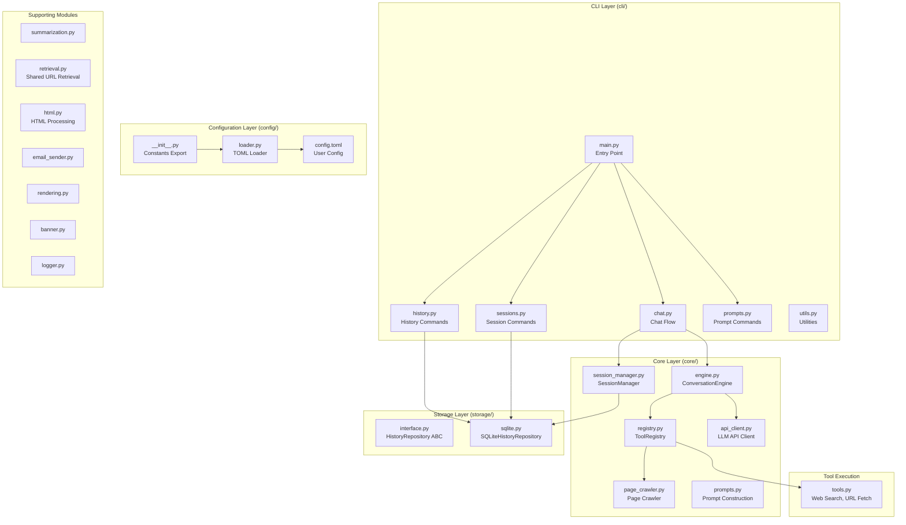

# asky Architecture

This document provides a comprehensive overview of the **asky** codebase architecture.

## High-Level Overview

asky is an AI-powered CLI tool that combines LLM capabilities with web search and tool-calling to provide intelligent, research-backed answers to queries.



---

## Package Structure

```
src/asky/
├── __init__.py         # Package init + lazy CLI entry wrapper
├── __main__.py         # Module entry point
├── cli/                # Command-line interface layer
│   ├── __init__.py     # Lazy CLI exports for lightweight imports
│   ├── main.py         # Argument parsing, command routing, lazy startup path
│   ├── chat.py         # Chat conversation flow
│   ├── history.py      # History viewing/deletion commands
│   ├── sessions.py     # Session management commands
│   ├── prompts.py      # User prompt listing
│   └── utils.py        # Query expansion, config printing
├── core/               # Core conversation engine
│   ├── __init__.py     # Lazy core exports
│   ├── engine.py       # ConversationEngine, tool registries
│   ├── registry.py     # ToolRegistry for tool management
│   ├── api_client.py   # LLM API calls, UsageTracker
│   ├── session_manager.py  # Session lifecycle, compaction
│   └── prompts.py      # System prompt construction
├── storage/            # Data persistence layer
│   ├── __init__.py     # Storage exports
│   ├── interface.py    # HistoryRepository ABC, Interaction dataclass
│   ├── sqlite.py       # SQLiteHistoryRepository implementation
│   └── session.py      # Session dataclass (legacy, merged into sqlite.py)
├── config/             # Configuration management
│   ├── __init__.py     # Constants export from TOML
│   └── loader.py       # TOML loading, config merging
├── research/           # Research mode cache, RAG, and adapters
│   ├── adapters.py     # Map custom tools to research source fetches
│   ├── cache.py        # Research cache, findings persistence, vector invalidation
│   ├── chunker.py      # Token-aware sentence chunking with char fallback
│   ├── embeddings.py   # In-memory sentence-transformers embedding client
│   ├── source_shortlist.py # Pre-LLM source candidate ranking (shared across modes)
│   ├── tools.py        # Research tool executors
│   └── vector_store.py # Chroma-backed dense retrieval + SQLite lexical fallback
├── config.toml         # Default configuration file
├── tools.py            # Tool execution (web search, URL fetch, custom tools)
├── retrieval.py        # Shared URL fetch + Trafilatura extraction (markdown/txt)
├── push_data.py        # HTTP data push to external endpoints
├── summarization.py    # Query/answer summarization logic
├── html.py             # HTML stripping and link extraction
├── email_sender.py     # Email sending via SMTP
├── rendering.py        # Browser rendering of markdown
├── banner.py           # CLI banner display
├── logger.py           # Logging configuration
└── template.html       # HTML template for browser rendering
```

---

## Core Components

### 1. CLI Layer (`cli/`)

The CLI is modularized for maintainability:

| Module | Responsibility |
|--------|----------------|
| `main.py` | Argument parsing (`argparse`), command routing, banner display |
| `chat.py` | Main chat flow: context loading, message building, engine invocation |
| `history.py` | `-H`, `-pa`, `--delete-messages` commands |
| `sessions.py` | `-sH`, `-ps`, `--delete-sessions`, `--session-end` commands |
| `sessions.py` | `-sH`, `-ps`, `--delete-sessions`, `--session-end` commands |
| `prompts.py` | `-p` command to list user prompts |
| `models.py` | `--add-model`, `--edit-model` interactive commands |
| `openrouter.py` | OpenRouter API client and caching logic |
| `utils.py` | Query expansion (`/cp`, `/prompt_key`), verbose config printing |

#### Startup Strategy (Lazy-by-Default)

- `asky/__init__.py`, `asky/cli/__init__.py`, `asky/core/__init__.py`, and `asky/research/__init__.py` now expose symbols lazily via wrapper functions / `__getattr__`.
- `cli/main.py` avoids eager imports of `chat`, `history`, `sessions`, `prompts`, and `utils` using lazy module proxies.
- `main()` now short-circuits quick commands (`--add-model`, `--edit-model`, prompt listing) before DB/cache startup work.
- Database initialization is conditional per command path instead of unconditional at process start.
- Research cache expiry cleanup is launched on chat path via a background daemon thread with a short non-blocking join head-start.
- File-based custom prompts are loaded only when needed (prompt listing or slash-command expansion).

#### Key CLI Flags

| Flag | Purpose |
|------|---------|
| `-m, --model` | Select model alias |
| `-c, --continue-chat` | Continue with context from previous IDs |
| `-s, --summarize` | Use summaries for context/URL content |
| `-L, --lean` | Disable pre-LLM source shortlisting for current run |
| `-H, --history [N]` | Show last N history entries |
| `-pa, --print-answer` | Print specific answer(s) by ID |
| `-ps, --print-session` | Print session content |
| `-ss, --sticky-session` | Start/resume persistent session |
| `--delete-messages` | Delete history records |
| `--delete-sessions` | Delete session records |
| `-o, --open` | Open result in browser |
| `--mail` | Send result via email |
| `--push-data` | Push result to configured endpoint |
| `--push-param KEY VALUE` | Dynamic parameter for push-data (repeatable) |
| `--add-model` | Interactively add a new model |
| `--edit-model` | Interactively edit a model |

---

### 2. Core Layer (`core/`)

#### ConversationEngine (`engine.py`)

The central orchestrator for multi-turn LLM conversations:

```python
class ConversationEngine:
    """Orchestrates multi-turn LLM conversations with tool execution."""
    
    def __init__(self, model_config, tool_registry, summarize, ...):
        # Initialize with model, tools, and optional session manager
        
    def run(self, messages: List[Dict]) -> str:
        # Main loop: send to LLM, parse tool calls, dispatch, repeat
        # Returns final answer after all tool calls complete
```

**Key Features:**
- Multi-turn tool execution loop (up to `MAX_TURNS`)
- Token usage tracking
- Integration with `SessionManager` for persistent sessions
- Lazy research/tool loading:
  - Research cache is instantiated only when message compaction needs cached summaries.
  - Standard tool executors (`web_search`, `get_url_content`, `get_url_details`, custom tool execution) are imported on first use.
  - Research tool schemas/executors are imported only when constructing the research registry.

#### ToolRegistry (`registry.py`)

Dynamic tool management for LLM function calling:

```python
class ToolRegistry:
    def register(name, schema, executor): ...
    def get_schemas() -> List[Dict]: ...  # For LLM payload
    def dispatch(call, summarize, usage_tracker, crawler_state): ...
```

**Tool Types:**
- **Built-in**: `web_search`, `get_url_content`, `get_url_details`
- **Custom**: User-defined in `config.toml` under `[tool.name]`

#### API Client (`api_client.py`)

Handles LLM API communication:

- `get_llm_msg()`: Send messages to LLM with retry logic
- `UsageTracker`: Track token usage per model alias
- `count_tokens()`: Naive token counting (chars / 4)

**Retry Logic:** Exponential backoff with `Retry-After` header support.

#### SessionManager (`session_manager.py`)

Manages persistent conversation sessions:

- **Sessions are Persistent**: Sessions never end - they are conversation threads that can be resumed anytime
- **Shell-Sticky Sessions**: Lock files in `/tmp/asky_session_{PID}` tie sessions to terminal instances
- **Auto-Naming**: When creating a session, names are auto-generated from query keywords (stopword filtering)
- **Duplicate Handling**: If multiple sessions match a name, user is prompted to select by ID
- **Context Compaction**: When context reaches threshold (default 80%), compacts history using:
  - `summary_concat`: Concatenate existing summaries (fast)
  - `llm_summary`: LLM-generated session summary (comprehensive)

---

### 3. Storage Layer (`storage/`)

#### Data Model

```python
@dataclass
class Interaction:
    id: Optional[int]
    timestamp: str
    session_id: Optional[int]  # NULL for history, set for session messages
    role: Optional[str]        # 'user' or 'assistant' for sessions
    content: str               # Message content
    query: str                 # For history (user message)
    answer: str                # For history (assistant message)
    summary: Optional[str]
    model: str
    token_count: Optional[int]
```

#### SQLiteHistoryRepository

Unified storage for both history and sessions:

**Tables:**
- `messages`: Unified table for all messages
  - `session_id IS NULL`: History entries (stored as paired rows)
  - `session_id IS NOT NULL`: Session messages
- `sessions`: Session metadata (id, name, model, created_at, compacted_summary)

**Key Methods:**
- `save_interaction()`: Save query/answer as two rows
- `get_history()`: Retrieve recent interactions
- `get_interaction_context()`: Build context string from IDs
- `delete_messages()` / `delete_sessions()`: Cascading deletion
- Session methods: `create_session`, `save_message`, `compact_session`, etc.

---

### 4. Configuration Layer (`config/`)

#### Loading Flow

1. `loader.py` loads bundled `config.toml` from package
2. Creates user config at `~/.config/asky/config.toml` if missing
3. Merges user config over defaults
4. Hydrates model definitions with API details

#### Key Configuration Sections

| Section | Purpose |
|---------|---------|
| `[general]` | Default model, timeouts, log settings, search provider |
| `[limits]` | Retry counts, snippet lengths, backoff settings |
| `[api.name]` | API endpoint definitions (URL, key) |
| `[models.alias]` | Model definitions referencing APIs (including per-model shortlist override) |
| `[prompts]` | System prompt templates |
| `[user_prompts]` | User-defined shortcuts (`/gn`, `/wh`) |
| `[tool.name]` | Custom tool definitions |
| `[research.source_adapters.name]` | Map research targets (e.g. `local://`) to custom tools |
| `[research.chromadb]` | ChromaDB persist path and collection names for research vectors |
| `[research.source_shortlist]` | Shared pre-LLM source shortlisting (seed URL parsing, seed-link expansion, search, fetch, scoring) |
| `[push_data.name]` | HTTP endpoint definitions for data push |
| `[session]` | Compaction threshold and strategy |
| `[email]` | SMTP settings |

---

### 5. Tool Execution (`tools.py`)

#### Built-in Tools

| Tool | Purpose |
|------|---------|
| `web_search` | Search via SearXNG or Serper API |
| `get_url_content` | Fetch extracted main content in lightweight markdown |
| `get_url_details` | Fetch extracted main content + discovered links |

#### Shared Retrieval Pipeline (`retrieval.py`)
- Standard tools, research tools, and shortlist fetching now share one URL retrieval path.
- Flow:
  - `requests` fetch with configured timeout/user-agent
  - Trafilatura main-content extraction (`markdown` or `txt`)
  - Metadata/title/date best-effort extraction
  - HTML fallback extraction when Trafilatura yields no usable content
  - Optional link extraction via `HTMLStripper`
- The shared payload includes `requested_url`, `final_url`, `content`, `title`, `date`, `links`, `source`, and optional warnings for debugging.

#### Custom Tools

Defined in `config.toml`:

```toml
[tool.list_dir]
command = "ls {flags} {path}"
description = "List directory contents."

[tool.list_dir.parameters]
type = "object"
required = ["path"]

[tool.list_dir.parameters.properties.path]
type = "string"
default = "."
```

Execution via `subprocess.run()` with argument quoting.

#### Research Source Adapters (`research/adapters.py`)

- Research mode supports adapter routing for non-HTTP sources while keeping the existing research tool schemas unchanged.
- Define adapters under `[research.source_adapters.*]` with `prefix` and either `tool` or `discover_tool` + `read_tool`
- Matching targets (such as `local://papers`) are fetched via the configured custom tool
- Adapter tool stdout must return JSON with `title`, `content`, and `links`
- Cached adapter content is reused by `get_link_summaries`, `get_relevant_content`, and `get_full_content`

#### Modular Research Prompts
- Research mode prompts can be constructed from components: `system_prefix`, `force_search`, and `system_suffix` defined in `research.toml`.
- If these modular components are present, they are joined with the current date injected into the prefix.
- This allows fine-grained control over research strategies (e.g., forcing search) without modifying the monolithic `research_system` prompt in `prompts.toml`.

#### Chroma-Backed Vector Retrieval (`research/vector_store.py`)
- Dense vector indexing and semantic retrieval for:
  - Content chunks (`content_chunks` in SQLite + Chroma collection)
  - Extracted links (`link_embeddings` in SQLite + Chroma collection)
  - Research findings (`research_findings` in SQLite + Chroma collection)
- Hybrid chunk ranking still combines:
  - Dense relevance from Chroma nearest-neighbor retrieval
  - Lexical relevance from SQLite BM25 (FTS5) or token overlap fallback
- If Chroma is unavailable at runtime, the system gracefully falls back to SQLite-based cosine scanning so research mode remains functional.

#### In-Memory Embedding Backend (`research/embeddings.py`)
- Embeddings are generated locally with `sentence-transformers` using `all-MiniLM-L6-v2` by default.
- The model is loaded lazily and kept in-memory via a singleton client.
- Model loading prefers local Hugging Face cache first; network download is attempted only on local cache miss when `local_files_only = false`.
- If the configured embedding model fails to load and `local_files_only = false`, the client automatically falls back to `sentence-transformers/all-MiniLM-L6-v2` and allows Hugging Face download.
- Model-load failures are cached so subsequent requests fail fast without repeated load attempts.
- Embedding usage stats (`texts_embedded`, `api_calls`, `prompt_tokens`) are still exposed for banner rendering.
- Lightweight token usage counting truncates to the model max sequence length to avoid tokenizer max-length warnings in logs.
- The tokenizer from the embedding model is reused by the chunker to keep chunk sizes aligned with model sequence limits.

#### Shared Source Shortlisting (`research/source_shortlist.py`)
- Runs before the first LLM call and can be enabled independently for research and standard chat modes.
- Effective enablement precedence is: `--lean` flag > model override (`models.<alias>.source_shortlist_enabled`) > global shortlist mode flags.
- Pipeline:
  - Extract seed URLs from prompt and build URL-stripped query text
  - Optionally extract keyphrases (YAKE) for search query construction
  - Gather candidates from prompt URLs, optional seed-page link expansion, and/or `web_search` results
  - Filter obvious utility/auth candidates early (signin/account/preferences/privacy/terms/cookie patterns and profile/support/account subdomains)
  - Normalize and deduplicate URLs (tracking param stripping, fragment removal)
  - Apply canonicalization and redirect-aware dedupe in fetch stage using final URLs when available
  - Fetch/extract main text through the shared retrieval pipeline (`retrieval.py`) in `txt` mode
  - Score candidates with embedding cosine similarity + lightweight heuristics
- Seed-page link expansion is configurable with per-run caps (`seed_link_max_pages`, `seed_links_per_page`) and is shared across research/non-research modes through the same shortlist module.
- Seed-page link extraction excludes `header`/`nav`/`footer`/`aside` containers by default in shortlist expansion to reduce boilerplate navigation links.
- If embedding model load has already failed in-process, shortlist skips embedding attempts and uses non-embedding heuristics only.
- Same-domain bonus is gated by relevance signal (semantic score or keyphrase overlap) and disabled for noise-path candidates.
- Debug-level observability includes per-stage timings and counters (search calls/results, seed-link extraction calls/discovered/added, fetch attempts/success/failures, embedding calls/doc counts).
- Produces a ranked shortlist payload, a trace block (`processed_candidates`, `selected_candidates`), and an optional compact context block injected into the user message.
- Supports optional status callbacks so the CLI banner can show pre-LLM shortlist progress while retrieval/scoring is running.
- Chat flow lazy-loads shortlist module entrypoints, and shortlist internals lazy-load YAKE/search/embedding helpers, so non-shortlist runs avoid shortlist-related import overhead.

#### Live Banner + Pre-LLM Progress
- `run_chat` starts the live banner before source shortlisting begins, so users see progress even before the first LLM request.
- Banner state now includes shortlist stats:
  - candidates collected
  - URLs processed/fetched
  - selected shortlist count
  - warning count
  - elapsed time
- Tool execution updates the same status region with transient per-tool messages.
- Verbose rich output (shortlist tables/tool argument panels) is routed through the active Live console to avoid breaking in-place banner redraw.
- Internal URL-content summarization now emits progress callbacks during hierarchical map/merge/final stages, and these callbacks refresh the same live banner status region so summarizer token usage changes are visible during long pre-answer processing.
- In verbose mode, URL summarization also prints Rich panels with per-URL input length, summary length, and compression ratio.

---

### 6. Supporting Modules

| Module | Purpose |
|--------|---------|
| `summarization.py` | Query/answer summarization with semantic chunking + hierarchical map-reduce for long text, plus per-call progress telemetry hooks |
| `retrieval.py` | Shared URL retrieval and Trafilatura-based extraction for standard/research/shortlist flows |
| `html.py` | `HTMLStripper`: Remove scripts/styles, extract links |
| `email_sender.py` | Send results via SMTP (markdown → HTML conversion) |
| `push_data.py` | HTTP data push to external endpoints (GET/POST) |
| `rendering.py` | `render_to_browser()`: Open markdown in browser |
| `banner.py` | Display CLI banner with model info |
| `logger.py` | Configure file-based logging |

#### Push Data Module (`push_data.py`)

Enables pushing query results to external HTTP endpoints:

**Key Functions:**
- `execute_push_data()`: Main execution function for HTTP requests
- `get_enabled_endpoints()`: Filter endpoints for LLM tool registration
- `_resolve_field_value()`: Handle static/env/dynamic/special field values
- `_build_payload()`: Construct request body from configuration
- `_resolve_headers()`: Process headers including environment variables

**Field Types:**
- **Static**: Literal string values
- **Environment**: Keys ending with `_env` read from environment
- **Dynamic**: `${param}` placeholders from LLM/CLI
- **Special**: `${query}`, `${answer}`, `${timestamp}`, `${model}`

**Usage:**
- CLI: `--push-data endpoint_name --push-param key value`
- LLM: Registered as `push_data_{endpoint_name}` tools when `enabled=true`

---

## Data Flow

### Standard Query Flow

```
User Query
    ↓
CLI (main.py) → parse_args()
    ↓
chat.py → load_context()
    ↓
optional source_shortlist.py (pre-LLM URL/search retrieval + ranking)
    ↓
build_messages()
    ↓
ConversationEngine.run()
    ↓
┌─────────────────────────────────────┐
│ Multi-Turn Loop:                    │
│   1. Send messages to LLM           │
│   2. Parse tool calls (if any)      │
│   3. Dispatch via ToolRegistry      │
│   4. Append results to messages     │
│   5. Repeat until no more calls     │
└─────────────────────────────────────┘
    ↓
generate_summaries() → save_interaction()
    ↓
(Optional) render_to_browser() / send_email()
```

### Session Flow

```
asky -ss "my_session" <query>
    ↓
SessionManager.start_or_resume()
    ↓
build_context_messages() ← includes compacted_summary + recent messages
    ↓
ConversationEngine.run()
    ↓
SessionManager.save_turn()
    ↓
check_and_compact() → compact if > threshold
```

### Research Retrieval Flow

```
extract_links(urls, query?)
    ↓
ResearchCache.cache_url()  # stores content + links with TTL
    ↓
if cached content/links changed:
    clear stale content_chunks/link_embeddings rows + Chroma vectors
    ↓
get_relevant_content(urls, query)
    ↓
chunk_text(content) uses token-aware sentence windows
    ↓
VectorStore ensures embeddings exist for current embedding model
    ↓
Hybrid ranking = Chroma dense search + BM25 lexical search (FTS5)
    ↓
Diversity filter removes near-duplicate chunks
    ↓
Top chunks returned with semantic + lexical relevance scores
```

---

## Design Decisions

### 1. Unified Messages Table
The `messages` table serves dual purpose:
- **History entries**: `session_id IS NULL`, stored as paired User + Assistant rows
- **Session messages**: `session_id IS NOT NULL`, individual message rows

This consolidation simplifies storage while maintaining clear separation.

### 2. Shell-Sticky Sessions
Sessions are tied to terminal instances via lock files (`/tmp/asky_session_{PID}`), allowing automatic session resumption within the same terminal without requiring the `-ss` flag on every invocation.

### 3. Dynamic Tool Registry
Tools are registered dynamically at runtime, enabling:
- Different tool sets for different tasks
- Easy addition of custom user-defined tools
- Clean separation between tool definition and execution

### 4. Naive Token Counting
Uses `chars / 4` approximation instead of actual tokenizer, reducing dependencies while providing "good enough" estimates for context management.

### 5. Chroma Dense + SQLite Lexical Hybrid
Research mode stores dense vectors in ChromaDB for fast semantic search while keeping SQLite tables for lexical/BM25 scoring and metadata joins. Cache invalidation clears both SQLite vector rows and Chroma vectors so retrieval freshness remains aligned with cached source content.

### 6. Shared Pre-LLM Source Shortlisting
Source shortlisting is implemented once and reused by both research and standard chat flows, with mode-specific enablement flags in config. This avoids duplicated retrieval logic while letting rollout stay controlled per mode.

---

## Testing

Tests are organized by component in `tests/`:

| Test File | Coverage |
|-----------|----------|
| `test_cli.py` | CLI argument parsing, command handlers |
| `test_storage.py` | Database operations, CRUD |
| `test_sessions.py` | Session lifecycle, compaction |
| `test_llm.py` | LLM API calls, conversation loop |
| `test_tools.py` | Tool execution, web search |
| `test_custom_tools.py` | Custom tool dispatch |
| `test_research_adapters.py` | Research adapter normalization and cache hydration |
| `test_integration.py` | End-to-end flows |
| `test_page_crawler.py` | Deep dive page crawler |
| `test_html.py` | HTML stripping |
| `test_config.py` | Configuration loading |
| `test_email.py` | Email sending |
| `test_expansion.py` | Query expansion |

Run tests with:
```bash
.venv/bin/pytest

# or 

uv run pytest
```

---

## Version Information

- **Python**: 3.10+
- **Key Dependencies**: `requests`, `rich`, `pyperclip`, `markdown`
- **Storage**: SQLite (local file at `~/.config/asky/history.db`)
- **Configuration**: TOML format
