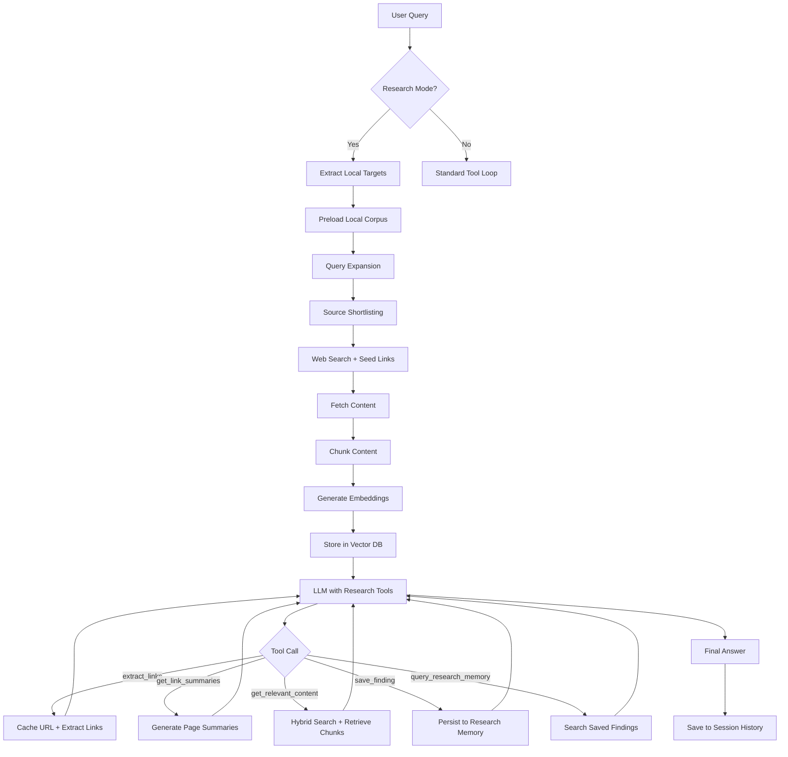

<!-- <font size="6">**asky**</font> -->


asky is an AI-powered web search CLI with LLM tool-calling capabilities.

It (can be invoked as `asky` or `ask`) provides a powerful command-line interface that brings AI-powered search and research capabilities directly to your terminal. It uses LLMs and tools to synthesize answers from the web (or from files and cli commands you expose as tools).

## Library Usage

For programmatic usage (`asky.api`), including full configuration and request options, see:

- [Library Usage Guide](./docs/library_usage.md)

## Key Features

- **Multi-Model Support**: Easily define and switch between various LLMs and providers that supports OpenAI compatible API.
- **Deep Research Mode**: A specialized mode for iterative, RAG-backed investigation across web sources and preloaded local corpora.
- **Tool-Calling Integration**: Models can autonomously perform web searches (via SearXNG or Serper API), fetch URL content, and get current date/time to provide accurate, up-to-date answers.
- **Custom Tools**: Expose any CLI command as a tool for the LLM. Define your own commands and parameters in `config.toml`.
- **File Prompts**: Load complex prompts directly from files using `file://` URIs (e.g., `asky file://my_prompt.txt`).
- **Smart Context Management**: Automatically summarizes web content and older conversation history to maximize the LLM's context window usage.
- **User Memory (Elephant Mode)**: Cross-session persistent memory that allows the LLM to remember facts, preferences, and details across separate conversations.
- **Conversation History**: Maintains a local SQLite database of your queries and answers (with their summaries), allowing for context-aware follow-up questions.
- **Predefined Prompts**: Users can define and quickly invoke common prompt patterns using simple slashes (e.g., `/gn` for get latest news from The Guardian).
- **Clipboard Integration**: Use `/cp` to expand the query with clipboard content.
- **Actionable Outputs**: Send results via email (`--mail`) or push them to an external endpoint (`--push-data`) directly from the CLI.
- **Model Management**: Interactive CLI commands (`--add-model`, `--edit-model`) to easily add and configure new models (including OpenRouter integration).
- **Token Efficient**: It counts token usage and keep the model informed about remaining context capacity to encourage it to finish the task before hitting the limit.

## How it Works

1. **User Query**: You provide a query to the `asky` command.
2. **Model Selection**: asky initializes the selected LLM based on your configuration.
3. **Tool Loop**: The LLM analyzes your query. If it needs real-world data, it calls integrated tools (like `web_search`).
4. **Context Synthesis**: asky fetches the data, cleans it, and feeds it back to the LLM. This process can repeat for up to 15 turns for complex research.
5. **Final Answer**: The LLM synthesizes all gathered information into a concise, formatted response.
6. **Persistence**: The interaction is saved to your local history for future reference.

## Installation

```bash
pip install asky-cli
```

Or install from source:

```bash
pip install -e .
```

To enable optional feature iTerm2 context integration:

```bash
pip install "asky-cli[iterm]"
```

Or if you are using `uv`:

```bash
uv tool install "asky-cli[iterm]"
# or from source
uv tool install -e ".[iterm]"
```

## Usage

> [!NOTE]
> **asky is powerful**: These examples show just a fraction of what you can do.

```

# Basic query
asky what is the correct temperature for green tea

# Research Mode (Iterative deep search)
asky -r "Compare the latest iPhone vs Samsung flagship specs and reviews"

# Research Mode with local corpus roots (see research.toml)
asky -r "Use /policies/security.md and summarize password requirements"

# Explicit local research corpus (implies --research)
asky -lc ./README.md "Summarize this file"

# Use a specific model
asky -m gf "Explain quantum entanglement"

# File Prompt (Great for code reviews or complex analysis)
asky file://code_review_checklist.txt

# Continue from previous query (by ID)
asky -c 1 tell me more about that

# Continue from last query (relative ID)
asky -c~1 explain more
# OR
asky -c "~2" what about the one before that?

# Send result to email
asky --mail user@example.com --subject "Meeting Summary" "Summarize the last 3 emails about Project X"

# User Memory (Elephant Mode)
asky -ss "My Session" -em "Remember that I prefer Python for backend tasks"
asky "What is my preferred backend language?"

# Manage memories
asky --list-memories
asky --delete-memory 5
asky --clear-memories

```

> [!NOTE]
> **Zsh Users**: When using `~` for relative IDs, you must either quote the value (e.g., `asky -c "~1"`) or place it immediately after the flag without a space (e.g., `asky -c~1`). If you use a space without quotes (e.g., `asky -c ~1`), zsh will attempt to expand it as a directory stack entry.

```console
➜  ~ asky -p

=== USER PROMPTS ===
  /gn         : Give me latest news from The Guardian, use https://www.theguardian.com/europe
  /wh         : how is weather in
====================

➜  ~ asky /wh delft
Dispatching tool call: web_search with args {'q': 'weather in Delft'}
Dispatching tool call: get_url_content with args {'urls': ...}

The weather in **Delft, South Holland, Netherlands** is currently **45°F and Cloudy with Showers in the Vicinity** (as of 4:20 pm CET).

Here is the forecast for today and the next couple of days:

...

Query completed in 3.88 seconds

--------------------------------------------------------------------------------
➜  ~ asky --help

Tool-calling CLI with model selection.

positional arguments:
  query                 The query string

-h, --help            show this help message and exit
  -m, --model {gf,glmair,glmflash,q34t,q34,lfm,q8,q30,onano,omini,qwenmax,qwenflash,qnext,glm47,nna3b,p4mini,On3b,Ogpt20,Ol370,lama1b,Ogfl,gfl,mini,glm5}
                        Select the model alias
  -c, --continue-chat HISTORY_IDS
                        Continue conversation with context from specific history IDs (comma-separated, e.g. '1,2').
  -s, --summarize       Enable summarize mode (summarizes URL content and uses summaries for chat context)
  --delete-messages [MESSAGE_SELECTOR]
                        Delete message history records. usage: --delete-messages [ID|ID-ID|ID,ID] or --delete-messages --all
  --delete-sessions [SESSION_SELECTOR]
                        Delete session records and their messages. usage: --delete-sessions [ID|ID-ID|ID,ID] or --delete-sessions --all
  --all                 Used with --delete-messages or --delete-sessions to delete ALL records.
  -H, --history [COUNT]
                        Show last N queries and answer summaries (default 10).
                        Use with --print-answer to print the full answer(s).
  -pa, --print-answer HISTORY_IDS
                        Print the answer(s) for specific history IDs (comma-separated).
  -ps, --print-session SESSION_SELECTOR
                        Print session content by session ID or name.
  -p, --prompts         List all configured user prompts.
  -v, --verbose         Enable verbose output (prints config and LLM inputs).
  -o, --open            Open the final answer in a browser using a markdown template.
  --mail RECIPIENTS     Send the final answer via email to comma-separated addresses.
  --subject EMAIL_SUBJECT
                        Subject line for the email (used with --mail).
  --push-data ENDPOINT  Push query result to a configured endpoint after query completes.
  --push-param KEY VALUE
                        Dynamic parameter for --push-data. Can be repeated. Example: --push-param title 'My Title'
  -ss, --sticky-session SESSION_NAME [SESSION_NAME ...]
                        Create and activate a new named session (then exits). Usage: -ss My Session Name
  --add-model           Interactively add a new model definition.
  --edit-model [MODEL_ALIAS]
                        Interactively edit an existing model definition.
  -rs, --resume-session SESSION_SELECTOR [SESSION_SELECTOR ...]
                        Resume an existing session by ID or name (partial match supported).
  -se, --session-end    End the current active session
  -sh, --session-history [COUNT]
                        Show last N sessions (default 10).
  -r, --research        Enable deep research mode with link extraction and RAG-based content retrieval.
                        In this mode, the LLM uses specialized tools:
                          - extract_links: Discover links (content cached, only links returned)
                          - get_link_summaries: Get AI summaries of cached pages
                          - get_relevant_content: RAG-based retrieval of relevant sections
                          - get_full_content: Get complete cached content
                          - save_finding: Persist insights to research memory
                          - query_research_memory: Semantic search over saved findings
  -lc PATH [PATH ...], --local-corpus PATH [PATH ...]
                        Local file or directory paths to ingest as research corpus. Implies --research.
                        Note: Non-existent paths are skipped with a warning.
                        Note: If more than 10 paths are provided, the list is truncated to the first 10.
  -sfm, --session-from-message HISTORY_ID
                        Convert a specific history message ID into a session and resume it.
  --reply               Resume the last conversation (converting history to session if needed).
  -L, --lean            Disable pre-LLM source shortlisting for this run (lean mode).
  -off, -tool-off, --tool-off TOOL
                        Disable an LLM tool for this run. Repeat or use comma-separated names (e.g. -off web_search -off get_url_content).
  -tl, --terminal-lines [LINE_COUNT]
                        Include the last N lines of terminal context in the query (default 10 if flag used without value).
  --completion-script {bash,zsh}
                        Print shell setup snippet for argcomplete and exit.
```

## Features in Depth

### Deep Research Mode (`-r`)

For complex topics, use `--research`. This enables a specialized prompt + toolset for multi-step investigation:

- **extract_links**: Scans pages to find relevant citations without loading full content.
- **get_link_summaries**: Rapidly summarizes multiple pages to decide which ones to read.
- **get_relevant_content**: Uses vector embeddings (via RAG) to pull only the specific paragraphs you need from a long document.
- **get_full_content**: Retrieves complete cached content for detailed analysis.
- **save_finding**: Persist insights to research memory for later retrieval.
- **query_research_memory**: Semantic search over saved findings using natural language.

#### Research Workflow



#### Session-Scoped Research Memory

Research mode automatically creates a session for each research run. Findings saved with `save_finding` are scoped to the session and persist across multiple turns within that session. Findings remain available until the session is explicitly deleted by the user. This enables:

- Building knowledge incrementally across multiple research turns
- Querying previously discovered insights
- Isolating research contexts between different topics

#### Hybrid Semantic Search

Research mode uses hybrid semantic search combining:

- **Dense retrieval**: ChromaDB nearest-neighbor cosine similarity
- **Lexical retrieval**: SQLite FTS5 BM25 scoring

The final score combines both approaches: `final_score = (dense_weight * semantic_score) + ((1 - dense_weight) * lexical_score)`. This provides both semantic understanding and precise keyword matching, with a fallback to SQLite-based cosine scan if Chroma is unavailable.

#### Evidence Extraction

Enable post-retrieval LLM fact extraction by setting `evidence_extraction_enabled = true` in `research.toml`. This extracts specific facts from retrieved chunks, useful for:

- Extracting compliance requirements from policy documents
- Identifying specific technical specifications
- Pulling out quantitative data points

#### Query Expansion

Research mode can decompose complex queries into sub-queries for better source discovery. Configure in `research.toml`:

```toml
query_expansion_enabled = true
query_expansion_mode = "deterministic"  # or "llm"
max_sub_queries = 4
```

- **deterministic**: Rule-based query decomposition
- **llm**: AI-powered query expansion (may be slower but more accurate)

#### Web-based research

Use natural prompts; the agent will search and read web sources as needed:

```bash
asky -r "Compare OAuth2 device flow vs PKCE for a CLI app"
```

#### Local-corpus research

Configure allowed local corpus roots in `research.toml`, then reference document paths in your query:

```toml
[research]
local_document_roots = [
  "/Users/you/docs/security",
  "/Users/you/docs/engineering"
]
```

```bash
asky -r "Use /handbook/authentication.md and list MFA requirements"
asky -r "Compare /rfc/rfc9110.txt with /policies/http-guidelines.md"
```

Important local behavior:

- Builtin local loading is enabled only when `research.local_document_roots` is set.
- Local targets are resolved **relative to configured roots**, even if the target starts with `/`.
- Supported local target forms include `local://...`, `file://...`, `/...`, `./...`, and `~/...`.
- Local paths are preprocessed/redacted from model-visible user text; local retrieval should flow through the research knowledge-base tools.

#### Mixed web + local research

You can combine both in one run:

```bash
asky -r "Use /policy/passwords.md and verify whether NIST 800-63B guidance has changed"
```

#### Local Source Adapters

Route non-HTTP sources to custom tools using the adapter system:

```toml
[research.source_adapters.local]
prefix = "local://"
tool = "read_local"  # or discover_tool + read_tool
```

The built-in local fallback handles `local://...`, `file://...`, and direct local paths when `research.local_document_roots` is configured. Supported file types include:

- Text-like: `.txt`, `.md`, `.markdown`, `.html`, `.htm`, `.json`, `.csv`
- Document-like: `.pdf`, `.epub` (via PyMuPDF)

**Security Guardrails**: Generic research tools (`extract_links`, `get_link_summaries`, `get_relevant_content`, `get_full_content`) reject local filesystem targets by design. Local-file access flows through explicit local-source tooling/adapters.

#### Advanced Research Use Cases

**Multi-Document Research**

```bash
# Compare multiple RFCs
asky -r "Compare /rfc/rfc9110.txt with /rfc/rfc9111.txt and identify key differences"
```

**Research Memory Persistence**

```bash
# Start a research session
asky -r "Investigate OAuth2 device flow implementation patterns"

# Later, query saved findings within the session
asky -r "What were the key security considerations from the OAuth2 research?"
```

**Evidence Extraction**

```bash
# Configure in research.toml: evidence_extraction_enabled = true
asky -r "Extract specific password requirements from /policies/security.md"
```

**Custom Source Adapters**

```bash
# Configure adapter in research.toml
# Then use custom sources
asky -r "Analyze local://my-knowledge-base for compliance issues"
```

### User Memory & Elephant Mode

asky now supports a persistent memory system that evolves with your conversations.

**Visualizing Memory:**

- **Session-Scoped**: By default, memories learned in a specific session (e.g., via `--session "ProjectX"`) are isolated to that session. Use this for project-specific details.
- **Global**: Memories can be made global (available to all sessions).
  - **Trigger**: Start any sentence with **"remember globally:"** or **"global memory:"** (configurable) to force a fact to be global.
  - **Effect**: The CLI strips this trigger, processes your prompt normally, and then extracts the fact into the global knowledge base.

**modes:**

1. **Manual**: You explicitly tell asky to remember something.
   ```bash
   asky "remember this: using python 3.12 for this project"
   # OR for global truth
   asky "remember globally: I always prefer clean architecture"
   ```
   sessions and conversations.

- **Manual Memory**: The LLM can proactively use the `save_memory` tool to store a fact it detects in the conversation.
- **Elephant Mode (`-em`)**: When active, asky automatically extracts key facts from the conversation at the end of each turn and saves them to your memory.
- **Global Recall**: Relevant memories are automatically retrieved and injected into the LLM's prompt in every conversation (unless in `--lean` mode).

#### Memory Management CLI

- **`--list-memories`**: View all saved facts and their IDs.
- **`--delete-memory MEMORY_ID`**: Remove a specific memory.
- **`--clear-memories`**: Wipe all saved memories.

#### How it works

1. **Extraction**: Facts are extracted as concise, standalone sentences (e.g., "The user prefers dark mode for UI designs").
2. **Storage**: Memories are stored in a local SQLite table and indexed in a vector database (ChromaDB) for semantic retrieval.
3. **Retrieval**: Every time you send a query, asky searches your memories for high-relevance facts (cosine similarity threshold of 0.35) and includes them as "User Memory" in the system prompt.
4. **Deduplication**: When saving new memories, asky checks for existing similar facts to avoid redundancy.

> [!IMPORTANT]
> **Elephant Mode requires a session**: To use `--elephant-mode` (or `-em`), you must be in an active session (using `-ss` or `-rs`).

#### Research Mode Architecture

Research mode is built on several core components:

| Component             | Description                                                                 |
| --------------------- | --------------------------------------------------------------------------- |
| **ResearchCache**     | Caches fetched URL content and extracted links with TTL-based expiry        |
| **VectorStore**       | Hybrid semantic search combining ChromaDB (dense) and SQLite BM25 (lexical) |
| **EmbeddingClient**   | Local sentence-transformer embeddings using all-MiniLM-L6-v2                |
| **TextChunker**       | Token-aware sentence chunking for optimal embedding boundaries              |
| **SourceShortlist**   | Pre-LLM source ranking pipeline for improved relevance                      |
| **QueryExpander**     | Decomposes complex queries into sub-queries                                 |
| **EvidenceExtractor** | Post-retrieval LLM fact extraction                                          |
| **Adapters**          | Routes non-HTTP sources to custom tools                                     |

#### Vector Collections

| Collection          | Content                                  |
| ------------------- | ---------------------------------------- |
| `content_chunks`    | Text chunks from cached pages            |
| `link_embeddings`   | Link anchor text for relevance filtering |
| `research_findings` | Saved insights for memory queries        |

### File Prompts

You can store complex prompts in a file and feed them to `asky`:

```bash
asky file://my_complex_prompt.txt
```

This is useful for repetitive tasks like "Code Review", "Summarize Release Notes", etc.
File prompts are validated for size limits (configurable in `config.toml`).

### Session Management

Organize your work into named sessions:

```bash
# Start a new session for a specific project
asky -ss "Project Alpha"

# Later, resume it
asky -rs "Project Alpha" what were we discussing?

# Convert a history item into a session and continue
asky -sfm 42 continue this thread
```

### Shell Auto-Completion

Enable tab completion for flags and dynamic values (models, history IDs, session IDs/names):

```bash
# Bash
asky --completion-script bash >> ~/.bashrc
source ~/.bashrc

# Zsh
asky --completion-script zsh >> ~/.zshrc
source ~/.zshrc
```

The generated snippet is self-contained and does not require `register-python-argcomplete` on your PATH.
History and session value suggestions include short previews (query/session name + timestamp) so numeric IDs are easier to pick.
For `-pa/--print-answer` and `-sfm/--session-from-message`, completion also includes word-based selector tokens that decode back to the original answer ID automatically.
Session completion (`-ps`, `-rs`) now returns one selector per session (name-derived token + hidden session ID), avoiding duplicate ID/name rows.
Continue-chat completion (`-c`) uses the same selector style for history items, and selector tokens resolve back to numeric IDs automatically.

### Output Actions

Automate your workflow by pushing results to other services:

- **Email**: `asky --mail me@work.com "Send me the daily briefing"`
- **Push Data**: `asky --push-data https://my-webhook.com/endpoint "Analyze this log"`

### Model Management

Easily manage your model configurations directly from the CLI:

```bash
# Interactively add a new model (searches OpenRouter)
asky --add-model

# Edit an existing model configuration
asky --edit-model my-alias
```

### Terminal Context Integration

This feature allows you to include the last N lines of your terminal screen as context for your query. Useful when you want to ask "why am I getting this error?".

- **Installation**: Requires `iterm` optional dependency.
- **Usage**: Add `-tl` or `--terminal-lines` flag. The default value is 10.
  ```bash
  asky -tl 5 why am I getting this error
  ```
- **Configuration**: You can modify `terminal_context_lines` in `config.toml` to set a different default value.
  > [!NOTE]
  > This feature requires iTerm2 Python API, you can enable it from iTerm2 settings.


## Custom Tools

You can define your own tools in `config.toml` that the LLM can use to interact with your local system. Each tool runs a CLI command and returns the output to the LLM.

Example configuration for a `list_dir` tool:

```toml
[tool.list_dir]
command = "ls"
description = "List the contents of a directory."
enabled = true

[tool.list_dir.parameters]
type = "object"
required = ["path"]

[tool.list_dir.parameters.properties.path]
type = "string"
default = "."
```

Example configuration for a `grep_search` tool:

```toml
[tool.grep_search]
command = "grep -r {pattern} {path}"
description = "Search for a pattern in files recursively."
enabled = false # Disabled by default for safety

[tool.grep_search.parameters]
type = "object"
required = ["pattern"]

[tool.grep_search.parameters.properties.pattern]
type = "string"
description = "The regex pattern to search for."

[tool.grep_search.parameters.properties.path]
type = "string"
description = "The directory path to search in."
default = "."
```

> [!CAUTION]
> **Security Risk**: Custom tools execute commands using your system shell. While asky attempts to quote arguments safely, exposing powerful CLI tools to an LLM can be risky. Use this feature with caution.

### How it works:

- **Placeholders**: Use `{param_name}` in the `command` string to inject arguments. If no placeholders are found, argument is appended to command.
- **Quoting**: All arguments are automatically cleaned (inner double-quotes removed) and wrapped in double-quotes for safety.
- **Execution**: Commands are executed via terminal shell, allowing for advanced piping and redirection.

> [!TIP]
> **Performance Tip**: When using recursive tools like `grep`, consider excluding large directories like `.venv` or `node_modules` to avoid timeouts:
> `command = "grep -r --exclude-dir={.venv,node_modules} {pattern} {path}"`

> [!NOTE]
> **Optional Parameters**: If you define a parameter with a `default` value in `config.toml`, it will be automatically injected into your `command` if the LLM omits it.

## Configuration options

[See default configuration](./src/asky/data/config/general.toml)

On first run, a default configuration directory is created at `~/.config/asky/` containing several TOML files to help organize your settings:

- `general.toml`: Basic settings (logging, search provider, timeouts)
- `api.toml`: API endpoint definitions
- `models.toml`: Model configurations
- `prompts.toml`: System prompts
- `user.toml`: User shortcuts and custom tools
- `push_data.toml`: Email and Push Data settings
- `research.toml`: Deep Research settings

You can edit these files individually to configure models, API keys, and other settings. The legacy `config.toml` is still supported for backward compatibility and overrides split files if present.

### Research mode configuration (`research.toml`)

Use `research.toml` to tune retrieval behavior and local corpus boundaries:

```toml
[research]
# Enable research mode tools
enabled = true

# Restrict local-source ingestion to these root directories
local_document_roots = [
  "/Users/you/docs/security",
  "/Users/you/docs/engineering"
]

# Cache TTL in hours (cached pages expire after this time)
cache_ttl_hours = 24

# Evidence extraction (post-retrieval LLM fact extraction)
evidence_extraction_enabled = false
evidence_extraction_max_chunks = 10

# Maximum links to return per URL (before relevance filtering)
max_links_per_url = 50

# Maximum links after relevance filtering (when query is provided)
max_relevant_links = 20

# Chunk size for content splitting (tokens, clamped by embedding model max length)
chunk_size = 256

# Chunk overlap for context continuity (tokens)
chunk_overlap = 48

# Number of relevant chunks to retrieve per URL in RAG queries
max_chunks_per_retrieval = 5

# Background summarization thread pool size
summarization_workers = 2

# Maximum findings to return from research memory queries
memory_max_results = 10

# ChromaDB configuration
[research.chromadb]
# Directory used by ChromaDB's persistent client
persist_directory = "~/.config/asky/chromadb"

# Collection names for research mode vectors
chunks_collection = "asky_content_chunks"
links_collection = "asky_link_embeddings"
findings_collection = "asky_research_findings"

# Source shortlisting configuration
[research.source_shortlist]
# Master switch for source shortlisting before first LLM call
enabled = true

# Enable source shortlisting in research mode
enable_research_mode = true

# Enable source shortlisting in standard (non-research) mode
enable_standard_mode = true

# If true, run web search even when the prompt already includes URLs
search_with_seed_urls = false

# If true, shortlist expansion extracts and adds links from seed URLs
seed_link_expansion_enabled = true

# Max number of seed pages to expand for links
seed_link_max_pages = 3

# Max extracted links to consider from each seed page before dedupe/caps
seed_links_per_page = 50

# Number of search results to pull as initial candidates
search_result_count = 40

# Candidate caps to control pre-LLM fetch cost
max_candidates = 40
max_fetch_urls = 20

# Number of ranked candidates to pass forward
top_k = 8

# Extracted text thresholds and payload sizing
min_content_chars = 300
max_scoring_chars = 5000
snippet_chars = 700
doc_lead_chars = 1400
query_fallback_chars = 600

# Keyphrase extraction controls
keyphrase_min_query_chars = 220
keyphrase_top_k = 20
search_phrase_count = 5

# Scoring heuristics
short_text_threshold = 700
same_domain_bonus = 0.05
overlap_bonus_weight = 0.10
short_text_penalty = 0.10
noise_path_penalty = 0.15

# Query expansion before shortlist and local-source ingestion
query_expansion_enabled = true
query_expansion_mode = "deterministic"  # or "llm"
max_sub_queries = 4

# Embedding model configuration
[research.embedding]
# Model name to load in-process
model = "all-MiniLM-L6-v2"

# Batch size for local encoding
batch_size = 32

# Torch device for embedding model (cpu, cuda, mps)
device = "cpu"

# Normalize vectors so cosine similarity is stable across retrieval calls
normalize = true

# If true, do not download models and use only local cache
local_files_only = false
```

#### Configuration Notes

- Keep `local_document_roots = []` to disable builtin local filesystem ingestion.
- For local ingestion, query-supplied targets are interpreted as corpus-relative paths under configured roots.
- Generic URL/content tools reject local filesystem targets by design; local corpus content is preloaded/indexed before model/tool turns in research mode.
- **Chunking**: `chunk_size` and `chunk_overlap` control how documents are split for embedding. Larger chunks capture more context but reduce precision; overlap ensures continuity.
- **Embeddings**: The default model `all-MiniLM-L6-v2` provides good balance of speed and accuracy. Change `device` to `cuda` or `mps` for GPU acceleration.
- **Source Shortlisting**: The pipeline ranks sources before the LLM sees them, improving relevance. Adjust `top_k` to control how many sources are passed to the model.

### API Keys

You can set API keys in two ways:

1. **Environment Variables**: Set `GOOGLE_API_KEY` (or other configured env vars) in your shell.
2. **Config File**: Add keys directly to `api.toml`.

Example `general.toml`:

```toml
[general]
default_model = "gf"
compact_banner = true
terminal_context_lines = 10
```

Example `api.toml`:

```toml
[api.gemini]
api_key_env = "GOOGLE_API_KEY"

[api.lmstudio]
url = "http://localhost:1234/v1/chat/completions"
```

### Verification

Run with `-v` to see the loaded configuration:

```bash
asky -v
```

## Web Search

asky works best with a web search tool. You can use SearXNG or Serper API.

### Serper API

Serper is a paid service, but gives 2500 requests for free.

### Install & configure SearXNG

SearXNG is free and open source, it's easy to set up with a single docker command.

Following command taken from [SearXNG docs](https://docs.searxng.org/admin/installation-docker.html#instancing).

```bash
docker pull docker.io/searxng/searxng:latest

# Create directories for configuration and persistent data
$ mkdir -p ./searxng/config/ ./searxng/data/
$ cd ./searxng/

# Run the container
$ docker run --name searxng -d \
    -p 8888:8080 \
    -v "./config/:/etc/searxng/" \
    -v "./data/:/var/cache/searxng/" \
    docker.io/searxng/searxng:latest
```

You need to add "-json" to the formats section of the default searxng config.yaml file.

```yaml
# remove format to deny access, use lower case.
# formats: [html, csv, json, rss]
formats:
  - html
  - json
```

Then restart the container.

```bash
docker restart searxng
```

## Requirements

- Python 3.10+
- Running SearXNG instance or Serper API key.
- LM Studio (for local models) or API keys for remote models

## License

MIT
