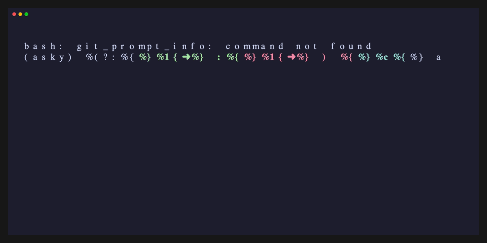

# User Memory & Elephant Mode

asky can save facts across sessions and inject them into future queries automatically. This page explains how the memory system works, how to save things to it, and how to manage what's stored.

## Two scopes of memory

Memory in asky has two scopes:

1. **Session-scoped** - memories saved while inside a named session (e.g., `--sticky-session "ProjectX"`) stay in that session and don't appear in unrelated queries.
2. **Global** - memories that apply everywhere, regardless of which session is active. Use these for things that are always true about you: your preferred language, your name, your timezone, etc.

## How to save memories

Three ways to save a memory:

### 1. Direct command (global scope)

Prefix your message with `remember globally:` or `global memory:`:

```bash
asky "remember globally: I always prefer clean architecture"
```

The prefix is the trigger - it must appear at the start of the message. The prefix is stripped before saving.

```bash
# Works - prefix at start:
asky "remember globally: I deploy to Kubernetes"

# Does not trigger memory save - prefix is not at the start:
asky "Can you remember globally that I use dark mode?"
```

### 2. Model saves automatically during conversation

The model has access to a `save_memory` tool and can call it when it spots a clear user preference or fact. Whether it does this depends on the model and what you said.

```bash
asky "For this project, we use Python 3.12 with strict typing."
# The model may call save_memory with this fact.
```

In verbose mode (`-v`), you will see the tool call if it happens.

### 3. Elephant mode - background extraction after each turn

`-em` (`--elephant-mode`) activates background extraction. After each turn, a background thread reviews the conversation and pulls out facts to save to the current session's memory.

```bash
asky -ss "API Rewrite" -em "We decided to use gRPC for the new endpoint."
```

Extraction runs after your answer arrives - it doesn't slow down the response.

## How recall works

Before each query, asky searches your saved memories using semantic similarity. Any memories scoring above the recall threshold are injected into the system prompt under a `## User Memory` section. The model sees them and uses them in the answer.

To see this in action, run with `-v` (verbose):

```bash
asky -v "what language should I use?"
```

If relevant memories exist, you'll see the `## User Memory` block in the output.

Memory recall is skipped in lean mode (`-L`).

## Concrete example

**Session 1 - save a fact:**

```bash
asky "remember globally: I use Python 3.12 with uv for package management"
```


<!-- vhs assets/shots/elephant-remember.tape -->

**Session 2 - different terminal, no flags:**

```bash
asky -v "how should I set up a new project?"
```


<!-- vhs assets/shots/elephant-recall.tape -->

## Managing memories

```bash
asky memory list          # see all saved memories with IDs and scopes
asky --delete-memory 5    # delete by ID
asky --clear-memories     # delete all memories (no undo)
```

## Technical details

- Memories are stored in a local SQLite table (`user_memories`).
- Semantic indexing uses ChromaDB (`asky_user_memories` collection) for retrieval.
- Deduplication: before saving, asky checks for existing memories with similarity > 0.90. If a near-duplicate is found, the existing entry is updated instead of creating a new one.
