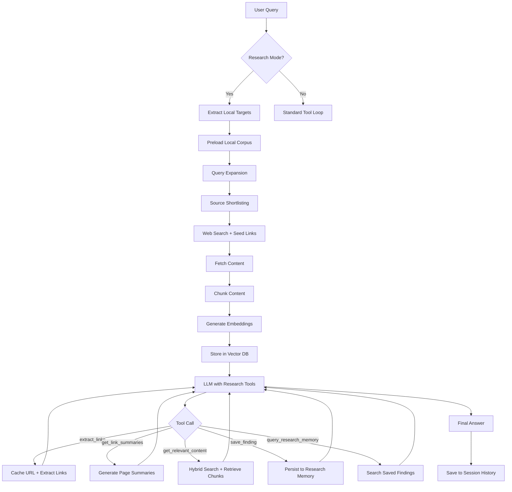

# Plan: Enhance README.md with Research Mode Documentation

## Overview
This plan outlines the enhancements needed to make the README.md comprehensive for the research mode feature. The current README covers basic usage but lacks detailed documentation of advanced features, configuration options, and the technical architecture.

---

## Detailed Tasks

### 1. Add Comprehensive Research Memory Tools Documentation
**Location**: After the existing tool descriptions (around line 202)

**Content to Add**:
- `save_finding` - Persist insights to research memory for later retrieval
- `query_research_memory` - Semantic search over saved findings
- Explain how these tools enable persistent research across multiple turns
- Show example usage of saving and querying findings

**Example**:
```markdown
- **save_finding**: Persist insights to research memory for later retrieval
- **query_research_memory**: Semantic search over saved findings using natural language
```

---

### 2. Document Session-Scoped Research Memory
**Location**: New subsection under "Deep Research Mode"

**Content to Add**:
- Explain that research mode automatically creates a session
- Session-scoped findings are isolated per research session
- Findings persist within the session and can be queried across turns
- Session cleanup removes associated findings and vectors

---

### 3. Add Evidence Extraction Feature Documentation
**Location**: New subsection under "Deep Research Mode"

**Content to Add**:
- Explain post-retrieval LLM fact extraction
- Configuration: `evidence_extraction_enabled` in research.toml
- Setting: `evidence_extraction_max_chunks` to control processing
- Use case: Extracting specific facts from retrieved content

---

### 4. Add Query Expansion Feature Documentation
**Location**: New subsection under "Deep Research Mode"

**Content to Add**:
- Explain query decomposition into sub-queries
- Two modes: `deterministic` (rule-based) and `llm` (AI-powered)
- Configuration: `query_expansion_enabled`, `query_expansion_mode`, `max_sub_queries`
- Benefit: Improves source discovery for complex queries

---

### 5. Expand Source Shortlisting Explanation
**Location**: Enhance existing source shortlist section (around line 415)

**Content to Add**:
- Complete pipeline explanation:
  1. Extract URLs from prompt
  2. Optional keyphrase extraction (YAKE)
  3. Collect candidates: seed URLs + search results + expanded links
  4. Fetch and extract main content
  5. Score with embeddings + heuristics
  6. Select top-k diverse sources
- Explain seed link expansion
- Document scoring heuristics (overlap bonus, same domain bonus, etc.)
- Show configuration options for tuning

---

### 6. Add Complete research.toml Configuration Reference
**Location**: Expand existing configuration section (around line 399)

**Content to Add**:
```markdown
### Research mode configuration (`research.toml`)

Use `research.toml` to tune retrieval behavior and local corpus boundaries:

```toml
[research]
# Enable research mode tools
enabled = true

# Restrict local-source ingestion to these root directories
local_document_roots = []

# Cache TTL in hours
cache_ttl_hours = 24

# Evidence extraction (post-retrieval LLM fact extraction)
evidence_extraction_enabled = false
evidence_extraction_max_chunks = 10

# Maximum links to return per URL
max_links_per_url = 50

# Maximum links after relevance filtering
max_relevant_links = 20

# Chunk size for content splitting (tokens)
chunk_size = 256

# Chunk overlap for context continuity (tokens)
chunk_overlap = 48

# Number of relevant chunks to retrieve per URL
max_chunks_per_retrieval = 5

# Background summarization thread pool size
summarization_workers = 2

# Maximum findings to return from research memory queries
memory_max_results = 10

# ChromaDB configuration
[research.chromadb]
persist_directory = "~/.config/asky/chromadb"
chunks_collection = "asky_content_chunks"
links_collection = "asky_link_embeddings"
findings_collection = "asky_research_findings"

# Source shortlisting configuration
[research.source_shortlist]
enabled = true
enable_research_mode = true
enable_standard_mode = true
search_with_seed_urls = false
seed_link_expansion_enabled = true
max_candidates = 40
max_fetch_urls = 20
top_k = 8

# Query expansion configuration
query_expansion_enabled = true
query_expansion_mode = "deterministic"
max_sub_queries = 4

# Embedding model configuration
[research.embedding]
model = "all-MiniLM-L6-v2"
batch_size = 32
device = "cpu"
normalize = true
local_files_only = false
```
```

---

### 7. Document Chunking and Embedding Configuration
**Location**: New subsection under configuration

**Content to Add**:
- Explain token-aware sentence chunking strategy
- How chunk_size and chunk_overlap affect retrieval
- Embedding model selection and device configuration
- Batch size for memory management
- Normalization for stable cosine similarity

---

### 8. Explain Hybrid Semantic Search Mechanism
**Location**: New subsection under "Deep Research Mode"

**Content to Add**:
- Explain combination of ChromaDB dense retrieval and SQLite BM25 lexical search
- Show scoring formula: `final_score = (dense_weight * semantic_score) + ((1 - dense_weight) * lexical_score)`
- Explain diversity filtering in chunk selection
- Mention fallback to SQLite-based cosine scan if Chroma unavailable

---

### 9. Add Local Source Adapters Documentation
**Location**: New subsection under "Deep Research Mode"

**Content to Add**:
- Explain adapter system for routing `local://` URLs to custom tools
- Configuration example:
```toml
[research.source_adapters.local]
prefix = "local://"
tool = "read_local"
```
- Built-in local fallback when `local_document_roots` is configured
- Supported file types: `.txt`, `.md`, `.html`, `.json`, `.csv`, `.pdf`, `.epub`
- Guardrails: Generic research tools reject local filesystem targets

---

### 10. Create Research Workflow Diagram
**Location**: New subsection under "Deep Research Mode"

**Content to Add**:


---

### 11. Add Advanced Research Use Cases
**Location**: New subsection after basic examples

**Content to Add**:
```markdown
### Advanced Research Use Cases

#### Multi-Document Research
```bash
# Compare multiple RFCs
asky -r "Compare /rfc/rfc9110.txt with /rfc/rfc9111.txt and identify key differences"
```

#### Research Memory Persistence
```bash
# Start a research session
asky -r "Investigate OAuth2 device flow implementation patterns"
# Save findings during research...

# Later, query saved findings
asky -r "What were the key security considerations from the OAuth2 research?"
```

#### Evidence Extraction
```bash
# Enable evidence extraction for fact-based queries
# Configure in research.toml: evidence_extraction_enabled = true
asky -r "Extract specific password requirements from /policies/security.md"
```

#### Custom Source Adapters
```bash
# Configure adapter in research.toml
# Then use custom sources
asky -r "Analyze local://my-knowledge-base for compliance issues"
```
```

---

### 12. Update Tool Descriptions in Help Text Section
**Location**: Update lines 172-177

**Content to Update**:
```markdown
  -r, --research        Enable deep research mode with link extraction and RAG-based content retrieval.
                        In this mode, the LLM uses specialized tools:
                          - extract_links: Discover links (content cached, only links returned)
                          - get_link_summaries: Get AI summaries of cached pages
                          - get_relevant_content: RAG-based retrieval of relevant sections
                          - get_full_content: Get complete cached content
                          - save_finding: Persist insights to research memory
                          - query_research_memory: Semantic search over saved findings
```

---

### 13. Add Research Mode Architecture Overview
**Location**: New section after "Features in Depth"

**Content to Add**:
```markdown
### Research Mode Architecture

Research mode is built on several core components:

| Component | Description |
|-----------|-------------|
| **ResearchCache** | Caches fetched URL content and extracted links with TTL-based expiry |
| **VectorStore** | Hybrid semantic search combining ChromaDB (dense) and SQLite BM25 (lexical) |
| **EmbeddingClient** | Local sentence-transformer embeddings using all-MiniLM-L6-v2 |
| **TextChunker** | Token-aware sentence chunking for optimal embedding boundaries |
| **SourceShortlist** | Pre-LLM source ranking pipeline for improved relevance |
| **QueryExpander** | Decomposes complex queries into sub-queries |
| **EvidenceExtractor** | Post-retrieval LLM fact extraction |
| **Adapters** | Routes non-HTTP sources to custom tools |

#### Collections

| Collection | Content |
|-----------|---------|
| `content_chunks` | Text chunks from cached pages |
| `link_embeddings` | Link anchor text for relevance filtering |
| `research_findings` | Saved insights for memory queries |
```

---

## Implementation Order

The enhancements should be implemented in this order to maintain logical flow:

1. Update tool descriptions in help text section (quick fix)
2. Add research memory tools documentation
3. Document session-scoped research memory
4. Add research workflow diagram
5. Add evidence extraction and query expansion documentation
6. Expand source shortlisting explanation
7. Add complete research.toml configuration reference
8. Document chunking and embedding configuration
9. Explain hybrid semantic search mechanism
10. Add local source adapters documentation
11. Add advanced research use cases
12. Add research mode architecture overview section

---

## Files to Reference

- `README.md` - Main file to update
- `src/asky/data/config/research.toml` - Configuration reference
- `src/asky/research/AGENTS.md` - Technical architecture details
- `docs/research_eval.md` - Evaluation and testing documentation
